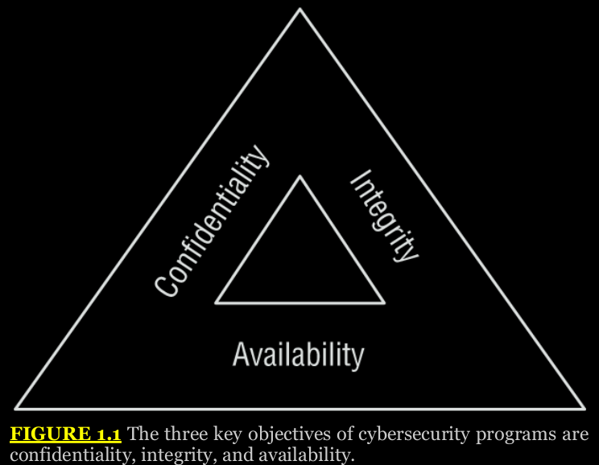
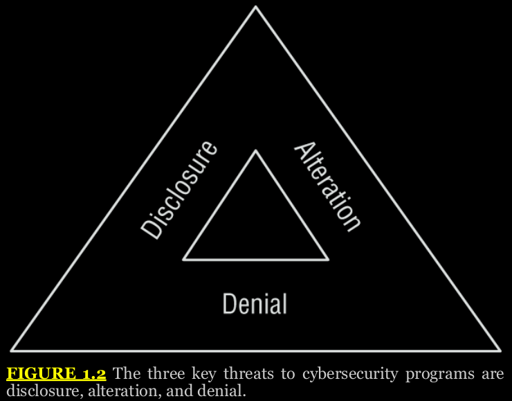

## Chapter 1 - Today's Security Professional

Security professionals are responsible for protecting the confidentiality, integrity, and availability of information and information systems used by their organizations.

## Cybersecurity Objectives

protecting sensitive information from unauthorized disclosure is certainly one element of a cybersecurity program, it is important to understand that cybersecurity actually has three complementary objectives, as shown in Figure 1.1.

  

**Confidentiality** ensures that unauthorized individuals are not able to gain access to sensitive information done by security controls, including firewalls, access control lists, and encryption, to prevent unauthorized access to information.

**Integrity** ensures that there are no unauthorized modifications to information or systems, either intentionally or unintentionally.

**Availability** ensures that information and systems are ready to meet the needs of legitimate users at the time those users request them.

Cybersecurity analysts often refer to these three goals, known as the CIA Triad, when performing their work.

## Data Breach Risks

Security incidents occur when an organization experiences a breach of the confidentiality, integrity, and/or availability of information or information systems. Security professionals are responsible for understanding these risks and implementing controls designed to manage those risks to an acceptable level. To do so, they must first understand the effects that a breach might have on the organization and the impact it might have on an ongoing basis.

## The DAD Triad

This model explains the three key threats to cybersecurity efforts: disclosure, alteration, and denial. Each of these three threats maps directly to one of the main goals of cybersecurity.

  

**Disclosure** is the exposure of sensitive information to unauthorized individuals, otherwise known as data loss. Disclosure is a violation of the principle of confidentiality. Attackers who gain access to sensitive information and remove it from the organization are said to be performing data exfiltration. Disclosure may also occur accidentally, such as when an administrator misconfigures access controls or an employee loses a device.

**Alteration** is the unauthorized modification of information and is a violation of the principle of integrity. Attackers may seek to modify records contained in a system for financial gain, such as adding fraudulent transactions to a financial account. Alteration may occur as the result of natural activity, such as a power surge causing a “bit flip” that modifies stored data. Accidental alteration is also a possibility, if users unintentionally modify information stored in a critical system as the result of a typo or other unintended activity.

**Denial** is the unintended disruption of an authorized user's legitimate access to information. Denial events violate the principle of availability. This availability loss may be intentional, such as when an attacker launches a distributed denial-of-service (DDoS) attack against a website. Denial may also occur as the result of accidental activity, such as the failure of a critical server, or as the result of natural activity, such as a natural disaster impacting a communications circuit.

The CIA and DAD triads are very useful tools for cybersecurity planning and risk analysis.

The CIA and DAD triads are very useful tools for cybersecurity planning and risk analysis. Whenever you find yourself tasked with a broad goal of assessing the security controls used to protect an asset or the threats to an organization, you can turn to the CIA and DAD triads for guidance. For example, if you're asked to assess the threats to your organization's website, you may apply the DAD triad in your analysis:

1. Does the website contain sensitive information that would damage the organization if disclosed to unauthorized individuals?

2. If an attacker were able to modify information contained on the website, would this unauthorized alteration cause financial, reputational, or operational damage to the organization?

3. Does the website perform mission-critical activities that could damage the business significantly if an attacker were able to disrupt the site?

You can use the CIA and DAD models in almost any situation to serve as a helpful starting point for a more detailed risk analysis.

## Breach Impact

The impacts of a security incident may be wide-ranging, depending upon the nature of the incident and the type of organization affected. We can categorize the potential impact of a security incident using the same categories that businesses generally use to describe any type of risk: financial, reputational, strategic, operational, and compliance.

## Financial Risk

**Financial risk** is, as the name implies, the risk of monetary damage to the organization as the result of a data breach. Financial risk may also be indirect and come as a second-order consequence of the breach. For example, if an employee loses a laptop containing plans for a new product, the organization suffers direct financial damage.

## Reputational Risk

Reputational risk occurs when the negative publicity surrounding a security breach causes the loss of goodwill among customers, employees, suppliers, and other stakeholders.

## Identity Theft

The most common impact on a dameged organization is the risk of identity theft posed by the exposure of personally identifiable information (PII) to unscrupulous individuals.

## Strategic Risk

Strategic risk is the risk that an organization will become less effective in meeting its major goals and objectives as a result of the breach.

## Operational Risk

Operational risk is risk to the organization's ability to carry out its day-to-day functions.

Operational risk and strategic risk are closely related, so it might be difficult to distinguish between them.

## Compliance Risk

Compliance risk occurs when a security breach causes an organization to run afoul of legal or regulatory requirements. For example, the Health Insurance Portability and Accountability Act (HIPAA) requires that health-care providers and other covered entities protect the confidentiality, integrity, and availability of protected health information (PHI). If an organization loses patient medical records, they violate HIPAA requirements and are subject to sanctions and fines from the U.S. Department of Health and Human Services. That's an example of compliance risk.

Organizations face many different types of compliance risk in today's regulatory landscape.

## Risks Often Cross Categories

In most cases, a risk will cross multiple risk categories. For example, if an organization suffers a data breach that exposes customer PII to unknown individuals, the organization will likely suffer reputational damage due to negative media coverage. However, the organization may also suffer financial damage. Some of this financial damage may come in the form of lost business due to the reputational damage.

## Implementing Security Controls

Security controls are specific measures that fulfill the security objectives of an organization.

## Security Control Categories

Security controls are categorized based on their mechanism of action: the way that they achieve their objectives. There are three different categories of security control:

**Technical controls** enforce confidentiality, integrity, and availability in the digital space. Examples of technical security controls include firewall rules, access control lists, intrusion prevention systems, and encryption.

**Operational controls** include the processes that we put in place to manage technology in a secure manner. These include user access reviews, log monitoring, and vulnerability management.

**Managerial controls** are procedural mechanisms that focus on the mechanics of the risk management process. Examples of
administrative controls include periodic risk assessments, security planning exercises, and the incorporation of security into the organization's change management, service acquisition, and project management practices.

Organizations should select a set of security controls that meets their control objectives based on the criteria and parameters that they either select for their environment or have imposed on them by outside regulators.

Many control objectives require a combination of technical, operational, and management controls. For example, an organization might have the control objective of preventing unauthorized access to a datacenter. They might achieve this goal by implementing biometric access control (technical control), performing regular reviews of authorized access (operational control), and conducting routine risk assessments (managerial control).

## Security Control Types

CompTIA also divides security into types, based on their desired effect. The types of security control include the following:

**Preventive controls** intend to stop a security issue before it occurs. Firewalls and encryption are examples of preventive controls.

**Detective controls** identify security events that have already occurred. Intrusion detection systems are detective controls.

**Corrective controls** remediate security issues that have already occurred. Restoring backups after a ransomware attack is an example of a corrective control.

**Deterrent controls** seek to prevent an attacker from attempting to violate security policies. Vicious guard dogs and barbed wire fences are examples of deterrent controls.

**Physical controls** are security controls that impact the physical world. Examples of physical security controls include fences, perimeter lighting, locks, fire suppression systems, and burglar alarms.

**Compensating controls** are controls designed to mitigate the risk associated with exceptions made to a security policy.

## Exploring Compensating Controls

The general idea is that a compensating control finds alternative means to achieve an objective when the organization cannot meet the original control requirement. In many cases, organizations adopt compensating controls to address a temporary exception to a security requirement. In those cases, the organization should also develop remediation plans designed to bring the organization back into compliance with the letter and intent of the original control.

# Data Protection

Security professionals spend significant amounts of their time focusing on the protection of sensitive data. We serve as stewards and guardians, protecting the confidentiality, integrity, and availability of the sensitive data created by our organizations and entrusted to us by our customers and other stakeholders.

As we think through data protection techniques, it's helpful to consider the three states where data might exist:

**Data at rest** is stored data that resides on hard drives, tapes, in the cloud, or on other storage media. This data is prone to pilfering by insiders or external attackers who gain access to systems and are able to browse through their contents.

**Data in motion** is data that is in transit over a network. When data travels on an untrusted network, it is open to eavesdropping attacks by anyone with access to those networks.

**Data in processing** is data that is actively in use by a computer system. This includes the data stored in memory while processing takes place. An attacker with control of the system may be able to read the contents of memory and steal sensitive information.

We can use different security controls to safeguard data in all of these states, building a robust set of defenses that protects our organization's vital interests.

## Data Encryption

Encryption technology uses mathematical algorithms to protect information from prying eyes. Its needed a decryption key to read the data, making it safe to store and transmit encrypted data over otherwise insecure means.

## Data Loss Prevention

Data loss prevention (DLP) systems help organizations enforce information handling policies and procedures to prevent data loss and theft.

DLP systems work in two different environments:

    Host-based DLP

    Network DLP

Host-based DLP uses software agents installed on systems that search those systems for the presence of sensitive information Taking the time to secure or remove information now may pay handsome rewards down the road if the device is lost, stolen, or compromised.

Host-based DLP can also monitor system configuration and user actions, blocking undesirable actions. For example, some organizations use host-based DLP to block users from accessing USB-based removable media devices that they might use to carry information out of the organization's secure environment.

Network-based DLP systems are dedicated devices that sit on the network and monitor outbound network traffic, watching for any transmissions that contain unencrypted sensitive information.

DLP systems also have two mechanisms of action:

**Pattern matching**, where they watch for the telltale signs of sensitive information. For example, if they see a number that is
formatted like a credit card or Social Security number, they can automatically trigger on that. Similarly, they may contain a database of sensitive terms, such as “Top Secret” or “Business Confidential,” and trigger when they see those terms in a transmission.

**Watermarking**, where systems or administrators apply electronic tags to sensitive documents and then the DLP system can monitor systems and networks for unencrypted content containing those tags.

Watermarking technology is also commonly used in digital rights management (DRM) solutions that enforce copyright and data ownership restrictions.

**Data Minimization**

Data minimization techniques seek to reduce risk by reducing the amount of sensitive information that we maintain on a regular basis. The best way to achieve data minimization is to simply destroy data when it is no longer necessary to meet our original business purpose.

An alternative to de-identifying data is transforming it into a format where the original information can't be retrieved. This is a process called data obfuscation, and we have several tools at our disposal to assist with it: 

    Hashing uses a hash function to transform a value in our dataset to a corresponding hash value. If we apply a strong hash function to a data element, we may replace the value in our file with the hashed value.

    Tokenization replaces sensitive values with a unique identifier using a lookup table. For example, we might replace a widely known value, such as a student ID, with a randomly generated 10-digit number. We'd then maintain a lookup table that allows us to convert those back to student IDs if we need to determine someone's identity. Of course, if you use this approach, you need to keep the lookup table secure!

    Masking partially redacts sensitive information by replacing some or all sensitive fields with blank characters. For example, we might replace all but the last four digits of a credit card number with X's or *'s to render the card number unreadable.

Although it isn't possible to retrieve the original value directly from the hashed value, there is one major flaw to this approach. If someone has a list of possible values for a field, they can conduct something called a rainbow table attack. In this attack, the attacker computes the hashes of those candidate values and then checks to see if those hashes exist in our data file.

## Summary

# Exam Essentials

**The three objectives of cybersecurity are confidentiality, integrity, and availability.** Confidentiality ensures that unauthorized individuals are not able to gain access to sensitive information. Integrity ensures that there are no unauthorized modifications to information or systems, either intentionally or unintentionally. Availability ensures that information and systems are ready to meet the needs of legitimate users at the time those users request them.

**Security controls may be categorized based on their mechanism of action and their intent.** Controls are grouped into the categories of managerial, operational, and technical based on the way that they achieve their objectives. They are divided into the types of preventive, detective, corrective, deterrent, compensating, and physical based on their intended purpose.

**Data breaches have significant and diverse impacts on organizations.** When an organization suffers a data breach, the resulting data loss often results in both direct and indirect damages. The organization suffers immediate financial repercussions due to the costs associated with the incident response, as well as long-term financial consequences due to reputational damage. This reputational damage may be difficult to quantify, but it also may have a lasting impact. In some cases, organizations may suffer operational damage if they experience ahave a lasting impact. In some cases, organizations may suffer operational damage if they experience availability damages, preventing them from accessing their own information.lability damages, preventing them from accessing their own information.

**Data must be protected in transit, at rest, and in use.** Attackers may attempt to eavesdrop on network transmissions containing sensitive information. This information is highly vulnerable when in transit unless protected by encryption technology. Attackers also might attempt to breach data stores, stealing data at rest. Encryption serves to protect stored data as well as data in transit. Data is also vulnerable while in use on a system and should be protected during data processing activities.

**Data loss prevention systems block data exfiltration attempts.** DLP technology enforces information handling policies to prevent data loss and theft. DLP systems may function at the host level, using software agents to search systems for the presence of sensitive information. They may also work at the network level, watching for transmissions of unencrypted sensitive information. DLP systems detect sensitive information using pattern-matching technology and/or digital watermarking.

**Data minimization reduces risk by reducing the amount of sensitive information that we maintain.** In cases where we cannot simply discard unnecessary information, we can protect information through de-identification and data obfuscation. The tools used to achieve these goals include hashing, tokenization, and masking of sensitive fields.
