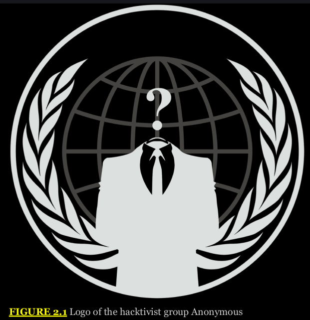

# Chapter 2 - Cybersecurity Threat Landscape

Cybersecurity threats have become increasingly sophisticated and diverse over the past three decades.

An environment that was once populated by lone hobbyists is now shared by skilled technologists organized criminal syndicates, and even government-sponsored attackers, all seeking to exploit the digital domain to achieve their own objectives.

You will learn how to build your own organization's threat intelligence capability to stay current as the threat environment evolves.

## Exploring Cybersecurity Threats

Cybersecurity threat actors differ significantly in their skills, capabilities, resources, and motivation.

## Classifying Cybersecurity Threats

Let's examine the characteristics that differentiate the types of cybersecurity threat actors Understanding our adversary is crucial to defending against them.

**Internal vs. External** We most often think about the threat actors who exist outside our organizations: competitors, criminals, and the curious. However, some of the most dangerous threats come from within our own environments. We'll discuss the insider threat later in this chapter.

**Level of Sophistication/Capability** Threat actors vary greatly in their level of cybersecurity sophistication and capability. As we explore different types of threat actors in this chapter, we'll discuss how they range from the unsophisticated script kiddie simply running code borrowed from others to the advanced persistent threat (APT) actor exploiting vulnerabilities discovered in their own research labs and unknown to the security community.

**Resources/Funding** Just as threat actors vary in their sophistication, they also vary in the resources available to them. Highly organized attackers sponsored by criminal syndicates or national governments often have virtually limitless resources, whereas less organized attackers may simply be hobbyists working in their spare time.

**Intent/Motivation** Attackers also vary in their motivation and intent. The script kiddie may be simply out for the thrill of the attack, whereas competitors may be engaged in highly targeted corporate espionage. Nation-states seek to achieve political objectives; criminal syndicates often focus on direct financial gain.

As we work through this chapter, we'll explore different types of threat actors. As we do so, take some time to reflect back on these characteristics. In addition, you may wish to reference them when you hear news of current cybersecurity attacks in the media and other sources. Dissect those stories and analyze the threat actors involved. If the attack came from an unknown source, think about the characteristics that are most likely associated with the attacker. These can be important clues during a cybersecurity investigation. For example, a ransomware attack seeking payment from the victim is more likely associated with a criminal syndicate seeking financial gain than a competitor engaged in corporate espionage.

**Threat Actors**

We can use to discuss the different types of threat actors, let's explore the most common types.

**Script Kiddies**

The term script kiddie is a derogatory term for people who use hacking techniques but have limited skills. Often such attackers may rely almost entirely on automated tools they download from the Internet. These attackers often have little knowledge of how their attacks actually work, and they are simply seeking out convenient targets of opportunity. Because they use simple, free or paid tools, script kids pose a great threat. Script kiddies are plentiful and unfocused in their work. They are much less discriminating in their target selection. In general, the motivations of script kiddies revolve around trying to prove their skill.

Fortunately, the number of script kiddies is often offset by their lack of skill and lack of resources. These individuals tend to be rather young, they work alone, and they have very few resources. And by resources, we mean time as well as money. A script kiddie normally can't attack your network 24 hours a day. They usually have to work a job, go to school, and attend to other life functions.

**Hacktivists**

Hacktivists use hacking techniques to accomplish some activist goal. They might deface the website of a company whose policies they disagree with. Or a hacktivist might attack a network due to some political issue. The defining characteristic of hacktivists is that they believe they are motivated by the greater good, even if their activity violates the law.

Their activist motivation means that measures that might deter other attackers will be less likely to deter a hacktivist. Because they believe that they are engaged in a just crusade, they will, at least in some instances, risk getting caught to accomplish their goals. They may even view being caught as a badge of honor and a sacrifice for their cause.

The skill levels of hacktivists vary widely. Some are only script kiddies, whereas others are quite skilled, having honed their craft over the years. In fact, some cybersecurity researchers believe that some hacktivists are actually employed as cybersecurity professionals as their “day job” and perform hacktivist attacks in their spare time. Highly skilled hacktivists pose a significant danger to their targets.

The resources of hacktivists also vary somewhat. Many are working alone and have very limited resources. However, some are part of organized efforts. The hacking group Anonymous, who uses the logo seen in Figure 2.1, is the most well-known hacktivist group. They collectively decide their agenda and their targets. Over the years, Anonymous has waged cyberattacks against targets as diverse as the Church of Scientology, PayPal, Visa and Mastercard, Westboro Baptist Church, and even government agencies.

  

This type of anonymous collective of attackers can prove quite powerful. Large groups will always have more time and other resources than a lone attacker. Due to their distributed and anonymous nature, it is difficult to identify, investigate, and prosecute participants in their hacking activities. The group lacks a hierarchical structure, and the capture of one member is unlikely to compromise the identities of other members.

## Criminal Syndicates

Organized crime appears in any case where there is money to be made, and cybercrime is no exception. The ranks of cybercriminals include links to traditional organized crime families in the United States, outlaw gangs, the Russian Mafia, and even criminal groups organized specifically for the purpose of engaging in cybercrime.

The common thread among these groups is motive and intent. The motive is simply illegal financial gain. Organized criminal syndicates do not normally embrace political issues or causes, and they are not trying to demonstrate their skills. In fact, they would often prefer to remain in the shadows, drawing as little attention to themselves as possible. They simply want to generate as much illegal profit as they possibly can.

In their 2019 Internet Organized Crime Threat Assessment (IOCTA), the European Union Agency for Law Enforcement Cooperation (EUROPOL) found that organized crime groups were active in a variety of cybercrime categories, including the following:

**Cyber-dependent crime**, including ransomware, data compromise, distributed denial-of-service (DDoS) attacks, website defacement, and attacks against critical infrastructure.

**Child sexual exploitation**, including child pornography, abuse, and solicitation.

**Payment fraud**, including credit card fraud and business email compromises.

**Dark web** activity, including the sale of illegal goods and services.

**Terrorism** support, including facilitating the actions of terrorist groups online.

**Cross-cutting crime factors**, including social engineering, money mules, and the criminal abuse of cryptocurrencies.

Organized crime tends to have attackers who range from moderately skilled to highly skilled. **It is rare for script kiddies to be involved in these crimes, and if they are, they tend to be caught rather quickly.** The other defining factor is that organized crime groups tend to have more resources, both in terms of time and money, than do hacktivists or script kiddies. They often embrace the idea that “it takes money to make money” and are willing to invest in their criminal enterprises in the hopes of yielding a significant return on their investments.

## Advanced Persistent Threats (APTs)

They are state actors hacking into either foreign governments or corporations. The security company Mandiant created the term advanced persistent threats (APTs) to describe a series of attacks that they first traced to sources connected to the Chinese military. In subsequent years, the security community discovered similar organizations linked to the government of virtually every technologically advanced country.

The term APT tells you a great deal about the attacks themselves. First, they used advanced techniques, not simply tools downloaded from the Internet. Second, the attacks are persistent, occurring over a significant period of time. In some cases, the attacks continued for years as attackers patiently stalked their targets, awaiting the right opportunity to strike.

The APT attacks that Mandiant reported are emblematic of nation-state attacks. They tend to be characterized by highly skilled attackers with significant resources. A nation has the labor force, time, and money to finance ongoing, sophisticated attacks. The motive can be political or economic.

    Zero-Day Attacks

    APT attackers often conduct their own security vulnerability research in an attempt to discover vulnerabilities that are not known to other attackers or cybersecurity teams. After they uncover a vulnerability, they do not disclose it but rather store it in a vulnerability repository for later use. Attacks that exploit these vulnerabilities are known as zero-day attacks. Zero-day attacks are particularly dangerous because they are unknown to product vendors, and therefore, no patches are available to correct them. APT actors who exploit zero-day vulnerabilities are often able to easily compromise their targets. Stuxnet is one of the most well-known examples of an APT attack.

## Insiders

Insider attacks occur when an employee, contractor, vendor, or other individual with authorized access to information and systems uses that access to wage an attack against the organization. Some are motivated by certain activist goals, whereas others are motivated by financial gain. Still others may simply be upset that they were passed over for a promotion or slighted in some other manner. An insider will usually be working alone and have limited financial resources and time. Behavioral assessments are a powerful tool in identifying insider attacks. Cybersecurity teams should work with human resources partners to identify insiders exhibiting unusual behavior and intervene before the situation escalates.

    The Threat of Shadow IT

    Dedicated employees often seek to achieve their goals and objectives through whatever means allows them to do so. Sometimes, this involves using technology services that aren't approved by the organization. They did not do this with any malicious intent. On the contrary, they were trying to benefit the business by being more productive. Shadow IT poses a risk to the organization because it puts sensitive information in the hands of vendors outside of the organization's control.

## Competitors

Competitors may engage in corporate espionage designed to steal sensitive information from your organization and use it to their own business advantage. This may include theft of customer information, stealing proprietary software, identifying confidential  product development plans, or gaining access to any other information that would benefit the competitor. In some cases, competitors will use a disgruntled insider to get information from your company. They may also seek out insider information available for purchase on the dark web, a shadowy anonymous network often engaging in illicit activity.

  

Your organization may want to consider other specific threat actors based on your threat models and profile, so you should not consider this a complete list. You should conduct periodic organizational threat assessments to determine what types of threat actors are most likely to target your organization, and why.

## Threat Vectors

Threat actors targeting an organization need some means to gain access to that organization's information or systems. Threat vectors are the means that threat actors use to obtain that access.

## Email and Social Media

Email is one of the most commonly exploited threat vectors. Phishing messages, spam messages, and other email-borne attacks are a simple way to gain access to an organization's network. These attacks are easy to execute and can be launched against many users simultaneously. The benefit for the attacker is that they generally need to succeed only one time to launch a broader attack. Even if 99.9 percent of users ignore a phishing message, the attacker needs the login credentials of only a single user to begin their attack.

## Wireless Networks

Wireless networks offer an even easier path onto an organization's network. Attackers don't need to gain physical access to the network or your facilities if they are able to sit in the parking lot and access your organization's wireless network.

## Removable Media

Attackers also commonly use removable media, such as USB drives, to spread malware and launch their attacks. An attacker might distribute inexpensive USB sticks in parking lots, airports, or other public areas, hoping that someone will find the device and plug it into their computer, curious to see what it contains. As soon as that happens, the device triggers a malware infection that silently compromises the finder's computer and places it under the control of the attacker.

## Cloud

Cloud services can also be used as an attack vector. Attackers routinely scan popular cloud services for files with improper access controls, systems that have security flaws, or accidentally published API keys and passwords.

## Third-Party Risks

Sophisticated attackers may attempt to interfere with an organization's IT supply chain, gaining access to devices at the manufacturer or while the devices are in transit from the manufacturer to the end user.

## Threat Data and Intelligence

Threat intelligence is the set of activities and resources available to cybersecurity professionals seeking to learn about changes in the threat environment. Building a threat intelligence program is a crucial part of any organization's approach to cybersecurity. If you're not familiar with current threats, you won't be able to build appropriate defenses to protect your organization against those threats. Threat intelligence information can also be used for predictive analysis to identify likely risks to the organization.

There are many sources of threat intelligence, ranging from open source intelligence (OSINT) that you can gather from publicly available sources, to commercial services that provide proprietary or closed-source intelligence information. An increasing number of products and services have the ability to consume threat feed data, allowing you to leverage it throughout your infrastructure and systems.

Regardless of their source, threat feeds are intended to provide up-to-date detail about threats in a way that your organization can leverage.

Threat feeds often include technical details about threats, such as IP addresses, hostnames and domains, email addresses, URLs, file hashes, file paths, CVE numbers, and other details about a threat. Additional information is often included to help make the information relevant and understandable, including details of what may make your organization a target or vulnerable to the threat, descriptions of threat actors, and even details of their motivations and methodologies.

Vulnerability databases are also an essential part of an organization's threat intelligence program. Reports of vulnerabilities certainly help direct an organization's defensive efforts, but they also provide valuable insight into the types of exploit being discovered by researchers.

Threat intelligence sources may also provide indicators of compromise (IoCs). These are the telltale signs that an attack has taken place and may include file signatures, log patterns, and other evidence left behind by attackers. IoCs may also be found in file and code repositories that offer threat intelligence information.

## Exploring the Dark Web

The dark web is a network run over standard Internet connections but using multiple layers of encryption to provide anonymous communication. Hackers often use sites on the dark web to share information and sell credentials and other data stolen during their attacks.

Threat intelligence teams should familiarize themselves with the dark web and include searches of dark web marketplaces for credentials belonging to their organizations or its clients.

## Proprietary and Closed-Source Intelligence

Commercial security vendors, government organizations, and other security-centric organizations also create and make use of proprietary, or closed-source intelligence. They do their own information gathering and research, and they may use custom tools, analysis models, or other proprietary methods to gather, curate, and maintain their threat feeds.

The sheer amount of data available via open source threat intelligence feeds can be overwhelming for many organizations. Combing through threat feeds to identify relevant threats, and then ensuring that they are both well-defined and applied appropriately for your organization, can require massive amounts of effort. Validating threat data can be difficult in many cases, and once you are done making sure you have quality threat data, you still have to do something with it!

## When a Threat Feed Fails

It is critical that you have reliable, up-to-date feeds to avoid situations where one feed are slow in implement solutions. You may want to have multiple feeds that you can check against each other—often one feed may be faster or release information sooner, so multiple good-quality, reliable feeds can be a big help!

## Threat maps

Threat maps provide a geographic view of threat intelligence. Many security vendors offer high-level maps that provide real-time insight into the cybersecurity threat landscape. However, threat map information should always be taken with a grain of salt because geographic attribution is notoriously unreliable.

## Assessing Threat Intelligence

Regardless of the source of your threat intelligence information, you need to assess it.

1. Is it timely? A feed that is operating on delay can cause you to miss a threat, or to react after the threat is no longer  relevant.

2. Is the information accurate? Can you rely on what it says, and how likely is it that the assessment is valid? Does it rely on a single source or multiple sources? How often are those sources correct?
   
3. Is the information relevant? If it describes the wrong platform, software, or reason for the organization to be targeted, the data may be very timely, very accurate, and completely irrelevant to your organization.

One way to summarize the threat intelligence assessment data is via a confidence score. Its a way to summarize the threat intelligence assessment data. Confidence scores allow organizations to filter and use threat intelligence based on how much trust they can give it.

## Assessing the Confidence Level of Your Intelligence

Many threat feeds will include a confidence rating, along with a descriptive scale. For example, ThreatConnect uses six levels of confidence:

    Confirmed (90–100) uses independent sources or direct analysis to prove that the threat is real.
    
    Probable (70–89) relies on logical inference, but does not directly confirm the threat.
    
    Possible (50–69) is used when some information agrees with the analysis, but the assessment is not confirmed.
    
    Doubtful (30–49) is assigned when the assessment is possible but not the most likely option, or the assessment cannot be proven or disproven by the information that is available.
    
    Improbable (2–29) means that the assessment is possible but is not the most logical option, or it is refuted by other information that is available.
    
    Discredited (1) is used when the assessment has been confirmed to be inaccurate or incorrect.

## Threat Indicator Management and Exchange

Managing threat information at any scale requires standardization and tooling to allow the threat information to be processed and used in automated ways. Indicator management can be much easier with a defined set of terms. That's where structured markup languages like STIX and OpenIOC come in.

Structured Threat Information eXpression (STIX) is an XML language originally sponsored by the U.S. Department of Homeland Security. In its current version, STIX 2.0 defines 12 STIX domain objects, including things like attack patterns, identities, malware, threat actors, and tools. These objects are then related to each other by one of two STIX relationship object models: either as a relationship or a sighting. A STIX 2.0 JSON description of a threat actor might read as follows:

    {
        "type": "threat-actor",
        "created": "2019-10-20T19:17:05.000Z",
        "modified": "2019-10-21T12:22:20.000Z",
        "labels": [ "crime-syndicate"],
        "name": "Evil Maid, Inc",
        "description": "Threat actors with access to hotel rooms",
        "aliases": ["Local USB threats"],
        "goals": ["Gain physical access to devices", "Acquire data"],
        "sophistication": "intermediate",
        "resource:level": "government",
        "primary_motivation": "organizational-gain"
    }

A companion to STIX is the Trusted Automated eXchange of Indicator Information (TAXII) protocol. TAXII is intended to allow cyber threat information to be communicated at the application layer via HTTPS. TAXII is specifically designed to support STIX data exchange.

Another option is the Open Indicators of Compromise (OpenIOC) format. Like STIX, OpenIOC is an XML-based framework. The OpenIOC schema was developed by Mandiant, and it uses Mandiant's indicators for its base framework. A typical IOC includes metadata like the author, the name of the IOC, and a description of the indicator. The full definition of the IOC may also include details of the actual compromise(s) that led to the indicator's discovery.

## Public and Private Information Sharing Centers

Threat intelligence communities have been created to share threat information. In the United States, organizations known as Information Sharing and Analysis Centers (ISACs) helpinfrastructure owners and operators share threat information and provide tools and assistance to their members.

## Conducting Your Own Research

As a security professional, you should continue to conduct your own research into emerging cybersecurity threats.

1. Vendor security information websites

2. Vulnerability and threat feeds from vendors, government agencies, and private organizations

3. Academic journals and technical publications, such as Internet Request for Comments (RFC) documents. RFC documents are particularly informative because they contain the detailed technical specifications for Internet protocols.

4. Professional conferences and local industry group meetings
   
5. Social media accounts of prominent security professionals

As you reference these sources, keep a particular eye out for information on adversary tactics, techniques, and procedures (TTPs). Learning more about the ways that attackers function allows you to improve your own threat intelligence program.

## Summary

Cybersecurity professionals must have a strong working understanding of the threat landscape in order to assess the risks facing their organizations and the controls required to mitigate those risks. Cybersecurity threats may be classified based on their internal or external status, their level of sophistication and capability, their resources and funding, and their intent and motivation.

Threat actors take many forms, ranging from relatively unsophisticated script kiddies who are simply seeking the thrill of a successful hack to advanced nation-state actors who use cyberattacks as a military weapon to achieve political advantage. Hacktivists, criminal syndicates, competitors, and other threat actors may all target the same organizations for different reasons.

Cyberattacks come through a variety of threat vectors. The most common vectors include email and social media; other attacks may come through direct physical access, supply chain exploits, network- based attacks, and other vectors. Organizations should build robust threat intelligence programs to help them stay abreast of emerging threats and adapt their controls to function in a changing environment.

## Exam Essentials

**Threat actors differ in several key attributes.** We can classify threat actors using four major criteria. First, threat actors may be internal to the organization, or they may come from external sources. Second, threat actors differ in their level of sophistication and capability. Third, they differ in their available resources and funding. Finally, different threat actors have different motivations and levels of intent.

**Threat actors come from many different sources.** Threat actors may be very simplistic in their techniques, such as script kiddies using exploit code written by others, or quite sophisticated, such as the advanced persistent threat posed by nation-state actors and criminal syndicates. Hacktivists may seek to carry out political agendas, whereas competitors may seek financial gain. We can group hackers into white-hat, gray-hat, and black-hat categories based on their motivation and authorization.

**Attackers exploit different vectors to gain initial access to an organization.** Attackers may attempt to gain initial access to an organization remotely over the Internet, through a wireless connection, or by attempting direct physical access. They may also approach employees over email or social media. Attackers may seek to use removable media to trick employees into unintentionally compromising their networks, or they may seek to spread exploits through cloud services. Sophisticated attackers may attempt to interfere with an organization's supply chain.

**Threat intelligence provides organizations with valuable insight into the threat landscape.** Security teams may leverage threat intelligence from public and private sources to learn about current threats and vulnerabilities. They may seek out detailed indicators of compromise and perform predictive analytics on their own data. Threat intelligence teams often supplement open source and closed-source intelligence that they obtain externally with their own research.

**Security teams must monitor for supply chain risks.** Modern enterprises depend on hardware, software, and cloud service vendors to deliver IT services to their internal and external customers. Vendor management techniques protect the supply chain against attackers seeking to compromise these external links into an organization's network. Security professionals should pay particular attention to risks posed by outsourced code development, cloud data storage, and integration between external and internal systems.

