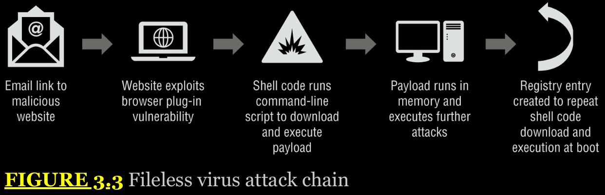

## Chapter 3 - Malicious Code

Malware comes in many forms, from ransomware and remote access Trojans to Trojans, bots, and the command-and-control infrastructures that allow attackers to run entire networks of compromised systems.

## Malware

The term malware describes a wide range of software that is intentionally designed to cause harm to systems and devices, networks, or users. Malware can also gather information, provideillicit access, and take a broad range of actions that the legitimate owner of a system or network may not want to occur. The SY0-601 Security+ exam objectives include a number of the most common types of malware, and you will need to be familiar with each of them, how to tell them apart, how you can identify them, and common techniques used in combatting them.

## Ransomware

Ransomware is malware that takes over a computer and then demands a ransom. There are many types of ransomware, including crypto malware, which encrypts files and then holds them hostage until a ransom is paid. Other ransomware techniques include threatening to report the user to law enforcement due to pirated software or pornography, or threatening to expose sensitive information or pictures from the victim's hard drive or device.

One of the most important defenses against ransomware is an effective backup system that stores files in a separate location that will not be impacted if the system or device it backs up is infected and encrypted by ransomware. Organizations that are preparing to deal with ransomware need to determine what their response will be;

## Trojans

Trojans, or Trojan horses, are a type of malware that is typically disguised as legitimate software. They are called Trojan horses because they rely on unsuspecting individuals running them, thus providing attackers with a path into a system or device. 

Some legitimate remote access tools are used as RATs, which can make identifying whether a tool is a legitimate remote support tool or a tool being used for remote access by an attacker difficult. Antimalware tools may also cause false positives when they find remote access tools that may be used as RATs, but disabling this detection can then result in RATs not being detected.

The Security+ Exam Outline calls out remote access Trojans (RATs) and Trojans separately. RATs are a subset of Trojans, so not every Trojan is a RAT. Make sure you remember that RATs provide remote access and monitoring of a system for attackers.

## Worms

Worms spread themselves. Although worms are often associated with spreading via attacks on vulnerable services, any type of spread through automated means is possible, meaning that worms can spread via email attachments, network file shares, or other methods as well. Worms also self-install, rather than requiring users to click on them, making them quite dangerous.

## Rootkits

Rootkits are malware that is specifically designed to allow attackers to access a system through a backdoor. Many modern rootkits also include capabilities that work to conceal the rootkit from detection through any of a variety of techniques, ranging from leveraging filesystem drivers to ensure that users cannot see the rootkit files, to infecting startup code in the master boot record (MBR) of a disk, thus allowing attacks against full-disk encryption systems.

Rootkit detection can be challenging, because a system infected with malware like this cannot be trusted. That means that the best way to detect a rootkit is to test the suspected system from a trusted system or device. In cases where that isn't possible, rootkit detection tools look for behaviors and signatures that are typical of rootkits.

Techniques like integrity checking and data validation against expected responses can also be useful for rootkit detection, and anti-rootkit tools often use a combination of these techniques to detect complex rootkits. Once a rootkit is discovered, removal can be challenging. Although some antimalware and anti-rootkit tools are able to remove specific rootkits, the most common recommendation whenever possible is to rebuild the system.

Like many of the malware types you will read about here, the best ways to prevent rootkits are normal security practices, including patching, using secure configurations, and ensuring that privilege management is used.

Tools like secure boot and techniques that can validate live systems and files can also be used to help prevent rootkits from being successfully installed or remaining resident.

## Backdoors

Backdoors are methods or tools that provide access that bypasses normal authentication and authorization procedures, allowing attackers access to systems, devices, or applications.

As with many of the malware types we discuss here, a malware infection may include multiple types of malware tools. As with many of the malware types we discuss here, a malware infection may include multiple types of malware tools.

As with many of the malware types we discuss here, a malware infection may include multiple types of malware tools.

Detecting backdoors can sometimes be done by checking for unexpected open ports and services, but more complex backdoor tools may leverage existing services. Examples include web-based backdoors that require a different URL under the existing web service, and backdoors that conceal their traffic by tunneling out to a remote control host using encrypted or obfuscated channels.

## Bots

Bots are remotely controlled systems or devices that have a malware infection. Groups of bots are known as botnets, and botnets are used by attackers who control them to perform various actions, ranging from additional compromises and infection, to denial-of-service attacks or acting as spam relays. Large botnets may have hundreds of thousands of bots involved in them, and some have had millions of bots in total.

Many botnet command and control (C&C) systems operate in a client-server mode, as shown in Figure 3.1. In this model, they willcontact central control systems, which provide commands and updates, and track how many systems are in the botnet. Internet Relay Chat (IRC) was frequently used to manage client-server botnets in the past, but many modern botnets rely on secure HTTP (HTTPS) traffic to help hide C&C traffic and to prevent it from easily being monitored and analyzed by defenders.

Command and control (C&C) servers are the core of a botnet. They allow attackers to manage the botnet, and advanced C&C tools have a broad range of capabilities that can help attackers steal data, conduct distributed denial-of-service attacks on a massive scale, deploy and update additional malware capabilities, and respond to attempts by defenders to protect their networks.

  

In addition to client-server botnets, peer-to-peer botnet control models, shown in Figure 3.2, are frequently used. Peer-to-peer networks connect bots to each other, making it harder to take down a single central server or a handful of known C&C IP addresses or domains. Encrypted peer-to-peer traffic can be exceptionally difficult to identify, although ML tools that monitor network traffic for behavior-based patterns as well as large, multiorganization datasets can help.

  

TEMINAR DPS

# Botnets and Distributed Denial-of-Service (DDoS) Attacks

Botnets can be used to attack services and applications, and distributed denial-of-service (DDoS) attacks against applications are one common application of botnets. Botnets rely on a combination on their size, which can overwhelm applications and services, and the number of systems that are in them, which makes it nearly impossible to identify which hosts are maliciously consuming resources or sending legitimate-appearing traffic with a malicious intent.

Identifying a botnet-driven DDoS attack requires monitoring network traffic, trends, and sometimes upstream visibility from an Internet service provider.

The symptoms can be difficult to identify from a significant increase in legitimate traffic, meaning that security tools like security information and event management (SIEM) systems that can correlate data from multiple sources may be required.

Identifying a botnet-driven DDoS attack requires monitoring network traffic, trends, and sometimes upstream visibility from an Internet service provider. The symptoms can be difficult to identify from a significant increase in legitimate traffic, meaning that security tools like security information and event management (SIEM) systems that can correlate data from multiple sources may be required. Behavior analysis tools can also help differentiate a DDoS from more typical traffic patterns.

## Keyloggers

Keyloggers are programs that capture keystrokes from keyboards, although keylogger applications may also capture other input like mouse movement, touchscreen inputs, or credit card swipes from attached devices. Keyloggers work in a multitude of ways, ranging from tools that capture data from the kernel, to APIs or scripts, or even directly from memory. Regardless of how they capture data, the goal of a keylogger is to capture user input to be analyzed and used by an attacker.

Preventing software keylogging typically focuses on normal security best practices. Since many keyloggers are aimed at acquiring passwords, use of multifactor authentication (MFA) can help limit the impact of a keylogger, even if it cannot defeat the keylogger itself.

In more complex security environments where underlying systems cannot be trusted, use of bootable USB drives can prevent use of a potentially compromised underlying operating system.

## Logic Bombs

Logic bombs, they are functions or code that are placed inside other programs that will activate when set conditions are met.
Though relatively rare compared to other types of malware, logic bombs are a consideration in software development and systems management, and they can have a significant impact if they successfully activate.

## Viruses

Computer viruses are malicious programs that self-copy and self- replicate. Viruses require one or more infection mechanisms that they use to spread themselves, typically paired with some form of search capability to find new places to spread to. Viruses also typically have both a trigger, which sets the conditions for when the virus will execute, and a payload, which is what the virus does, delivers, or the actions it performs. Viruses come in many varieties, including: 

    Memory-resident viruses, which remain in memory while the system of device is running.

    Non-memory-resident viruses, which execute, spread, and then shut down.

    Boot sector viruses, which reside inside the boot sector of a drive or storage media.

    Macro viruses, which use macros or code inside word processing software or other tools to spread.

    Email viruses, which spread via email either as attachments or as part of the email itself using flaws within email clients.

## Fileless Viruses

Fileless virus attacks are similar to traditional viruses in a number of critical ways. They spread via methods like spam email and malicious websites, and they exploit flaws in browser plug-ins and web browsers themselves. Once they successfully find a way into a system, they inject themselves into memory and conduct further malicious activity, including adding the ability to reinfect the system by the same process at reboot through a registry entry or other technique. At no point do they require local file storage, because they remain memory resident throughout their entire active life—in fact, the only stored artifact of many fileless attacks would be the artifacts of their persistence techniques, like the registry entry shown in Figure 3.3.

As you might expect from the infection flow diagram in Figure 3.3, fileless attacks require a vulnerability to succeed, so ensuring that browsers, plug-ins, and other software that might be exploited by attackers are up to date and protected can prevent most attacks. Using antimalware tools that can detect unexpected behavior from scripting tools like PowerShell can also help stop fileless viruses. Finally, network-level defenses like IPSs, as well as reputation-based protection systems, can prevent potentially vulnerable systems from browsing known malicious sites.

## Spyware

Spyware is malware that is designed to obtain information about an individual, organization, or system. Many spyware packages track users' browsing habits, installed software, or similar information and report it back to central servers. Some spyware is relatively innocuous, but malicious spyware exists that targets sensitive data, allows remote access to web cameras, or otherwise provides illicit or undesirable access to the systems it is installed on. Spyware is associated with identity theft and fraud, advertising and redirection of traffic, digital rights management (DRM) monitoring, and with stalkerware, a type of spyware used to illicitly monitor partners in relationships.

Spyware is most frequently combated using antimalware tools, although user awareness can help prevent the installation of spyware that is included in installers for software.

## Potentially Unwanted Programs (PUPs)

PUPs are programs that may not be wanted by the user but are not as dangerous as other types of malware. PUPs are typically installed without the user's awareness or as part of a software bundle or other installation. PUPs include adware, browser toolbars, web browser–tracking programs, and others. A discussion about awareness and best practices with the end user, removal with appropriate tools, and a return to normal operation may be all that you need to do with most PUP installations.

## Malicious Code

Scripts and custom-built code that isn't malware can both be used by malicious actors as well. These attacks can happen locally or remotely via a network connection, and they often leverage built-in tools like Windows PowerShell and Visual Basic, or Bash and Python on Linux systems. Even macros like those built into Microsoft's Office Suite can be leveraged by attackers.

PowerShell, the built-in Windows scripting language, is a popular target for malicious actors because of the powerful capabilities it provides.

Defenses against PowerShell attacks include using Constrained Language Mode, which limits sensitive commands in PowerShell, and using Windows Defender's built-in Application Control tool or AppLocker to validate scripts and to limit which modules and plug- ins can be run. It is also a good idea to turn on logging for PowerShell as well as Windows command-line auditing.

Microsoft Office macros written in Visual Basic for Applications (VBA) are another target for attackers. Although macro viruses are no longer as common as they once were, macros embedded in Office documents and similar functionality in other applications are potential targets for attackers, and if new vulnerabilities are discovered in Office, the popularity of macro viruses could increase. Office disables macros by default. This means that the primary defense against macro-based malware is educating users to not enable macros on unknown or untrusted documents.

Linux systems are also targeted. Attackers may leverage common languages and tools like Python, Perl, and Bash as part of their attack process. Languages like these can be used to create persistent remote access using bind or reverse shells, as well as a multitude of other useful exploit tools. Metasploit, a popular exploit tool, includes rootkits that leverage each of these languages.

Preventing use of built-in or preexisting tools like programming languages and shells makes security that prevents attackers from gaining access to the systems through vulnerabilities, compromised accounts, and other means one of the most important layers of defense.

There are existing tools to search for rootkits like chkrootkit and rkhunter, which can help defenders search for and identify rootkits. Behavior-based security tools can also monitorsystem logs and network traffic to help defenders identify compromised systems.

**Adversarial Artificial Intelligence**

Artificial Intelligence (AI) is used by attackers for malicious purposes. The focus of adversarial AI attacks currently tends to deal with data poisoning, providing security and analytic AI and ML algorithms with adversarial input that serves the attacker's purposes, or attacks against privacy.

It helps to better understand two key terms in use here. The first is artificial intelligence, which focuses on accomplishing “smart” tasks by combining ML, deep learning, and related techniques that are intended to emulate human intelligence. The second is machine learning, which is a subset of AI. ML systems modify themselves as they evolve to become better at the task that they are set to accomplish.

Every new technology provides attackers with a new attack surface, and ML is no different. Tainted training data for machine learning algorithms will be a target, and the security of machine learning algorithms themselves will be increasingly important. At the same time, new attack and defense techniques will be developed. As a security analyst, you can take some basic steps now:

    Understand the quality and security of source data.

    Work with AI and ML developers to ensure that they are working in secure environments and that data sources, systems, and tools are maintained in a secure manner.

    Ensure that changes to AI and ML algorithms are reviewed, tested, and documented.

    Encourage reviews to prevent intentional or unintentional bias in algorithms.

    Engage domain experts wherever possible.

## Summary

Malware comes in many forms. Ransomware encrypts your files or threatens to expose your data if you don't make a payment or perform an action. Trojans look like legitimate software but are actually malicious. Worms spread themselves, usually by targeting vulnerable applications or services. Rootkits help attackers access a system and maintain access to the system over time. Backdoors bypass authentication and system security to allow attackers or even sometimes legitimate users in through a concealed access method. Bots make systems part of a command-and-control network, allowing attackers to control huge numbers of systems at once to do things like conduct DDoS attacks. Keyloggers capture keystrokes so that attackers can steal passwords or other sensitive data, and logic bombs wait for a specific occurrence before causing damage or taking other unwanted actions. Viruses self-copy and self-spread. Fileless viruses are memory resident and don't reside on disks, making them harder to find and remove.

In addition to truly malicious malware, spyware is a type of malware that spies on users, providing information to advertisers or others. Potentially unwanted programs (PUPs) are not as dangerous as other types of malware, but they may be annoying like adware or other software that most users wouldn't want on their systems.

Malicious code like scripts and macros can also be a threat to systems, and attackers often leverage built-in scripting languages like PowerShell or Bash, as well as common programming languages like Python and Perl, to conduct malicious activities. Ensuring that malicious code cannot easily be run is part of securing systems against this type of attack.

Finally, new attackers are appearing in the field of adversarial AI. As machine learning and artificial intelligence are becoming more common, new methods focus on how to exploit AI and ML systems by providing them with bad data or by modifying their programming to produce desired malicious effects.

## Exam Essentials

**There are many types of malware.** Malware includes ransomware, Trojans, worms, potentially unwanted programs, fileless viruses, bots and their associated command-and-control systems, crypto malware, logic bombs, spyware, keyloggers, remote access Trojans, rootkits, and backdoors. Each type of malware hasdistinctive elements, and you need to know what identifies each type of malware, how to identify it, what controls are commonly deployed against it, and what to do if you encounter it.

**Scripts and other code can be malicious.** Built-in scripting languages and tools like PowerShell, Python, Bash, and macro languages like Visual Basic for Applications (VBA) can all be leveraged by attackers. Fileless malware often leverages PowerShell to download and execute itself once it leverages a flaw in a browser or plug-in to gain access to a Windows system. Attackers can use languages like Python to run code that can be hard to detect on Linux systems, allowing remote access and other activities to occur. Macros included in Office documents require users to enable them, but social engineering can help attackers to bypass default security settings.

**Adversarial artificial intelligence** is an emerging threat. As artificial intelligence and machine learning become more common throughout the industry, attackers are also starting to look at how to leverage them as part of their attacks. Introducing bad or tainted data into machine learning environments can help attackers conceal malware or otherwise decrease the effectiveness of ML tools and AI- based detection and security systems. At the same time, the algorithms that are used for AI and ML tools can also be attacked, and modifications to those algorithms could benefit attackers.

