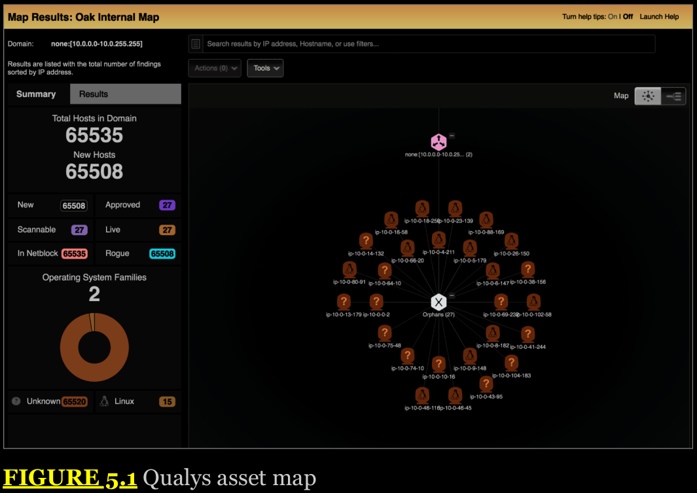
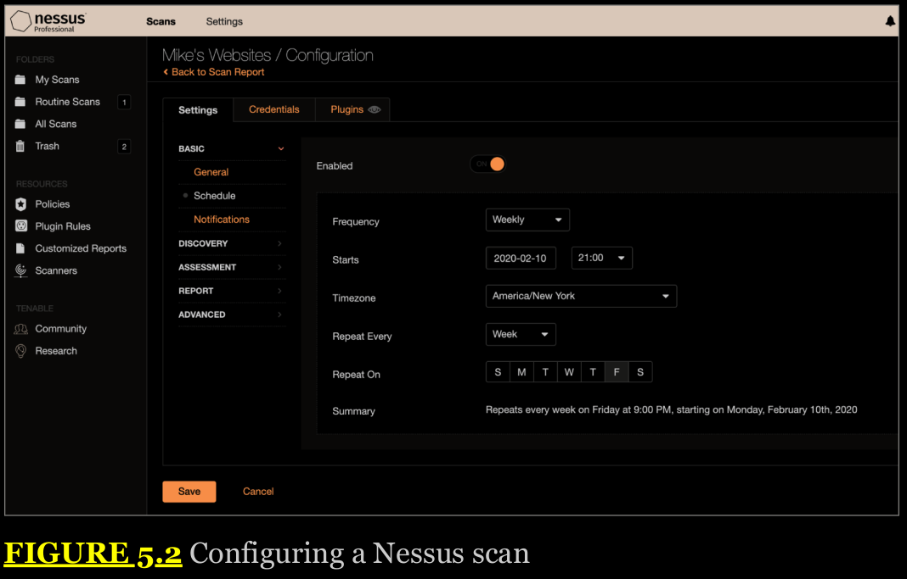
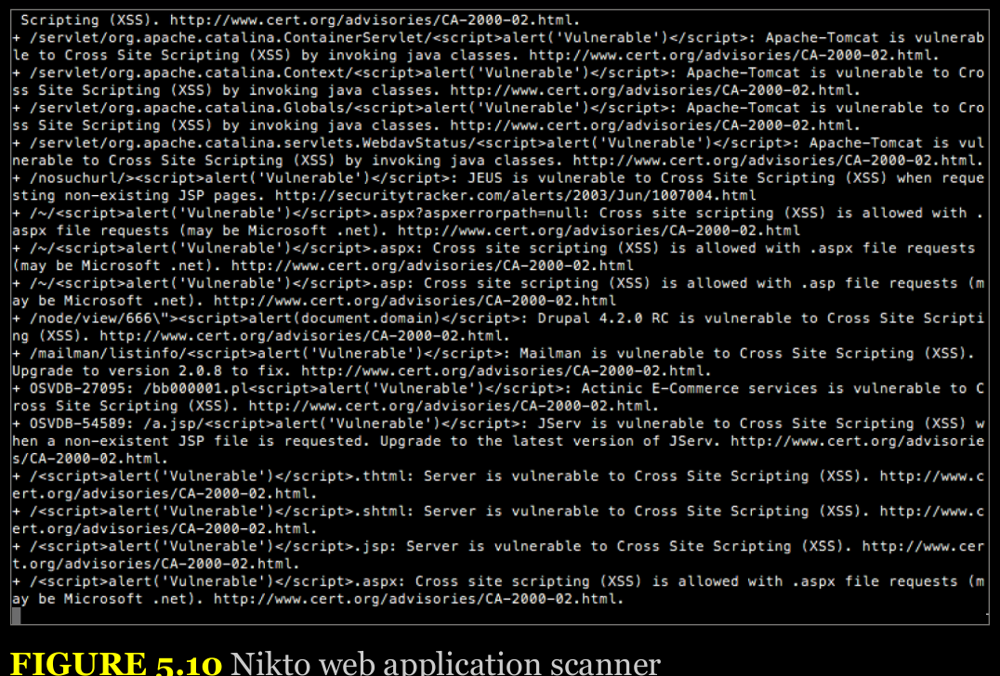
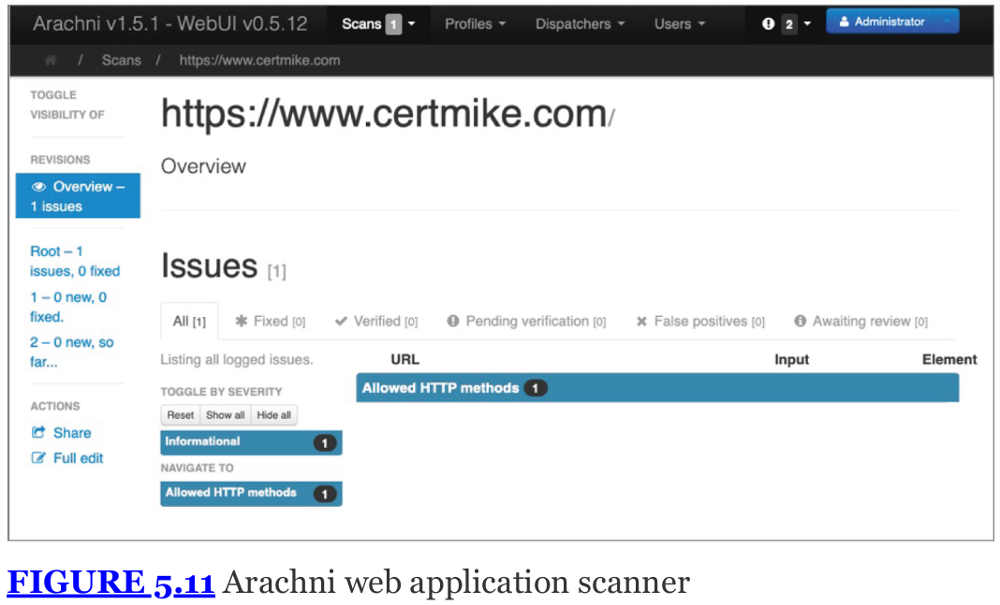

# Chapter 5 Security Assessment and Testing

Cybersecurity professionals are responsible for building, operating, and maintaining security controls that protect against these threats. An important component of this maintenance is performing regular security assessment and testing to ensure that controls are operating properly and that the environment contains no exploitable vulnerabilities. This chapter begins with a discussion of vulnerability management, including the design, scheduling, and interpretation of vulnerability scans.

## Vulnerability Management

Our technical environments are complex. We operate servers, endpoint systems, network devices, and many other components that each run millions of lines of code and process complex configurations.

Vulnerability management programs play a crucial role in identifying, prioritizing, and remediating vulnerabilities in our environments. They use vulnerability scanning to detect new vulnerabilities as they arise and then implement a remediation workflow that addresses the highest-priority vulnerabilities. Every organization should incorporate vulnerability management into their cybersecurity program.

## Identifying Scan Targets

Once an organization decides that it wishes to conduct vulnerability scanning and determines which regulatory requirements apply to their scans, they move on to the more detailed phases of the planning process. The next step is to identify the systems that will be covered by the vulnerability scans. Some organizations choose to cover all systems in their scanning process, whereas others scan systems differently (or not at all) depending on the answers to many different questions, including:

    - What is the data classification of the information stored, processed, or transmitted by the system?

    - Is the system exposed to the Internet or other public or semipublic networks?

    - What services are offered by the system?

    - Is the system a production, test, or development system?
  
Organizations also use automated techniques to identify the systems that may be covered by a scan. Cybersecurity professionals use scanning tools to search the network for connected systems. hetherthey were previously known or unknown, and to build an asset inventory. Figure 5.1 shows an example of an asset map developed using the Qualys vulnerability scanner's asset inventory functionality.

  

Administrators may then supplement this inventory with additional information about the type of system and the information it handles. This information then helps make determinations about which systems are critical and which are noncritical. Asset inventory and asset criticality information helps guide decisions about the types of scans that are performed, the frequency of those scans, and the priority administrators should place on remediating vulnerabilities detected by the scan. 

## Determining Scan Frequency

Cybersecurity professionals depend on automation to help them perform their duties in an efficient, effective manner. Vulnerability scanning tools allow the automated scheduling of scans to take the burden off administrators.

  

Administrators should configure these scans to provide automated alerting when they detect new vulnerabilities. Many security teams configure their scans to produce automated email reports of scan results.

Many different factors influence how often an organization decides to conduct vulnerability scans against its systems:

    The organization's risk appetite is its willingness to tolerate risk within the environment. If an organization is extremely risk averse, it may choose to conduct scans more frequently to minimize the amount of time between when a vulnerability comes into existence and when it is detected by a scan.

    Regulatory requirements, such as those imposed by the Payment Card Industry Data Security Standard (PCI DSS) or the Federal Information Security Management Act (FISMA), maydictate a minimum frequency for vulnerability scans. These requirements may also come from corporate policies.
 

Cybersecurity professionals must balance each of these considerations when planning a vulnerability scanning program. It is usually wise to begin small and slowly expand the scope andfrequency of vulnerability scans over time to avoid overwhelming the scanning infrastructure or enterprise systems.

## Configuring Vulnerability Scans

Vulnerability management solutions provide administrators with the ability to configure many different parameters related to scans. In addition to scheduling automated scans and producing reports, administrators may customize the types of checks performed by the scanner, provide credentials to access target servers, install scanning agents on target servers, and conduct scans from a variety of network perspectives. It is important to conduct regular configuration reviews of vulnerability scanners to ensure that scan settings match current requirements.

## Scan Sensitivity Levels

Cybersecurity professionals configuring vulnerability scans should pay careful attention to the configuration settings related to the scan sensitivity level. These settings determine the types of checks that the scanner will perform and should be customized to ensure that the scan meets its objectives while minimizing the possibility of disrupting the target environment.

Typically, administrators create a new scan by beginning with a template.

TODO REVISAR ESSE TOPICO, PG 171

## Supplementing Network Scans

Basic vulnerability scans run over a network, probing a system from a distance. This provides a realistic view of the system's security by simulating what an attacker might see from another network vantage point. However, the firewalls, intrusion prevention systems, and other security controls that exist on the path between the scanner and the target server may affect the scan results, providing an inaccurate view of the server's security independent of those controls.

**Credentialed Scanning**  Administrators provides the scanner with credentials that allow the scanner to connect to the target server and retrieve configuration information. Scans typically only retrieve information from target servers and do not make changes to the server itself. Therefore, administrators should enforce the principle of least privilege by providing the scanner with a read-only account on the server. This reduces the likelihood of a security incident related to the scanner's credentialed access.

**Agent-based scanning** In this approach, administrators install small software agents on each target server.These agents conduct scans of the server configuration, providing an “inside-out” vulnerability scan, and then report information back to the vulnerability management platform for analysis and reporting.

## Scan Perspective 

Comprehensive vulnerability management programs provide the ability to conduct scans from a variety of scan perspectives. Each scan perspective conducts the scan from a different location on the network, providing a different view into vulnerabilities. External scan gives a view of administrators a view of what an attacker located outside the organization would see as potential vulnerabilities. Internal scans might run from a scanner on the general corporate network, providing the view that a malicious insider might encounter. scanners located inside the datacenter and agents located on the servers offer the most accurate view of the real state of the server by showing vulnerabilities that might be blocked by other security controls on the network. Controls that might affect scan results include the following:

- Firewall settings
- Network segmentation
- Intrusion detection systems (IDSs)
- Intrusion prevention systems (IPSs)

## Scanner Maintenance

As with any technology product, vulnerability management solutions require care and feeding to ensure that the scanning software and vulnerability feeds remain up-to-date, without security issues and bug issues. 

## Vulnerability Plug-in Feeds

Security researchers discover new vulnerabilities every week, and vulnerability scanners can only be effective against these vulnerabilities if they receive frequent updates to their plug-in. Administrators should configure their scanners to retrieve new plug- ins on a regular basis, preferably daily. Fortunately, as shown in this process is easily automated.

## Security Content Automation Protocol (SCAP)

SCAP is an effort by the security community, led by the National Institute of Standards and Technology (NIST), to create a standardized approach for communicating security-related information. This standardization is important to the automation of interactions between security components. The SCAP standards include the following:

**Common Configuration Enumeration** (CCE) Provides a standard nomenclature for discussing system configuration issues.

**Common Platform Enumeration** (CPE) Provides a standard nomenclature for describing product names and versions

**Common Vulnerabilities and Exposures** (CVE) Provides a standard nomenclature for describing security- related software flaws.

**Extensible Configuration Checklist Description Format** (XCCDF) A language for specifying checklists and reporting checklist results

**Open Vulnerability and Assessment Language** (OVAL) A language for specifying low-level testing procedures used by checklists

## Vulnerability Scanning Tools

As you fill out your cybersecurity toolkit, you will want to have a network vulnerability scanner, an application scanner, and a web application scanner available for use. Vulnerability scanners are often leveraged for preventive scanning and testing and are also found in penetration testers toolkits where they help identify systems that testers can exploit. This fact also means they're a favorite tool of attackers!

## Infrastructure Vulnerability Scanning

Network vulnerability scanners are capable of probing a wide range of network-connected devices for known vulnerabilities. They reach out to any systems connected to the network, attempt to determine the type of device and its configuration, and then launch targeted tests designed to detect the presence of any known vulnerabilities on those devices.

The following tools are examples of network vulnerability scanners:

- Tenable's Nessus is a well-known and widely respected network vulnerability scanning product that was one of the earliest products in this field. 

- Qualys's vulnerability scanner is a more recently developed commercial network vulnerability scanner that offers a unique deployment model using a software-as-a-service (SaaS) management console to run scans using appliances located both in on-premises datacenters and in the cloud.

- Rapid7's Nexpose is another commercial vulnerability management system that offers capabilities similar to those of Nessus and Qualys.

- The open source OpenVAS offers a free alternative to commercial vulnerability scanners.

Every mature organization should have at least one scanner in their toolkit.

## Application Scanning

Application scanning tools are commonly used as part of the software development process and they are used to identify security vulnerabilities too.

Application testing occurs using three techniques:

**Static testing** analyzes code without executing it. This approach points developers directly at vulnerabilities and often provides specific remediation suggestions.

**Dynamic testing** executes code as part of the test, running all the interfaces that the code exposes to the user with a variety of inputs, searching for vulnerabilities.

**Interactive testing** combines static and dynamic testing, analyzing the source code while testers interact with the application through exposed interfaces.

Application testing should be an integral part of the software development process.

## Web Application Scanning

Web application scanners are specialized tools used to examine the security of web applications. These tools test for web-specific vulnerabilities, such as SQL injection, cross-site scripting (XSS), and cross-site request forgery (CSRF) vulnerabilities. They work by combining traditional network scans of web servers with detailed probing of web applications using such techniques as sending known malicious input sequences and fuzzing in attempts to break the application. Nikto is a popular web application scanning tool. Another open source tool available for web application scanning is Arachni.

Most organizations do use web application scanners, but they choose to use commercial products that offer advanced capabilities and user-friendly interfaces. Although there are dedicated web application scanners, such as Acunetix, on the market, many firms use the web application scanning capabilities of traditional network vulnerability scanners, such as Nessus, Qualys, and Nexpose.

## Reviewing and Interpreting Scan Reports

Vulnerability scan reports provide analysts with a significant amount of information that assists with the interpretation of the report.

  

  

**FROM PAG 185 to 192 - MUST BE STUDIED IN THE BOOK.**

## Security Vulnerabilities

Cybersecurity analysts should be familiar with the most commonly detected vulnerabilities and some of the general categories that cover many different vulnerability variants.

## Patch Management

Applying security patches to systems should be one of the core practices of any information security program, but this routine task is often neglected due to a lack of resources for preventive maintenance.

**Patch Management** is a program that routinely patches security issues.

## Legacy Platforms

Software vendors eventually discontinue support for every product they make. This is true for operating systems as well as applications. Its is a big risk for organizations. Best practice dictates isolating the system as much as possible, preferably not connecting it to any network, and applying as many compensating security controls as possible, such as increased monitoring and implementing strict network firewall rules.

## Weak Configurations

Vulnerability scans may also highlight weak configuration settings on systems, applications, and devices. These weak configurations may include the following:

- The use of default settings that pose a security risk, such as administrative setup pages that are meant to be disabled before moving a system to production. 

- The presence of unsecured accounts, including both normal user account and unsecured root accounts with administrative privileges. Accounts may be considered unsecured when they either lack strong authentication or use default passwords.

- Open ports and services that are not necessary to support normal system operations. This will vary based on the function of a server or device but, in general, a system should expose only the minimum number of services necessary to carry out its function.

- Open permissions that allow users access that violates the principle of least privilege.

These are just a few examples of the many weak configuration settings that may jeopardize security.

#### `Be sure that you understand these issues, because they are likely to appear on exam questions!`

## Error Messages

Many application development platforms support **debug modes** that give developers crucial error information needed to troubleshoot applications in the development process. Debug mode typically provides detailed information on the inner workings of an application and server, as well as supporting databases. Although this information can be useful to developers, it can inadvertently assist an attacker seeking to gain information about the structure of a database, authentication mechanisms used by an application, or other details. For this reason, vulnerability scans do alert on the presence of debug mode on scanned servers. Solving this issue requires the cooperation of developers and disabling debug modes on systems with public exposure.

## Insecure Protocols

Many of the older protocols used on networks in the early days of the Internet were designed without security in mind. They often failed to use encryption to protect usernames, passwords, and the content sent over an open network, exposing the users of the protocol to eavesdropping attacks. Telnet is one example of an insecure protocol used to gain command-line access to a remote server. The File Transfer Protocol (FTP) provides the ability to transfer files between systems but does not incorporate security features.

The solution for this issue is to simply switch to a more secure protocol. Fortunately, encrypted alternatives exist for both Telnet and FTP. System administrators can use Secure Shell (SSH) as a secure replacement for Telnet when seeking to gain command-lineaccess to a remote system. Similarly, the Secure File Transfer Protocol (SFTP) and FTP-Secure (FTPS) both provide a secure method to transfer files between systems.

## Weak Encryption

Encryption is a crucial security control used in every cybersecurity program to protect stored data and data in transit over networks. As with any control, however, encryption must be configured securely to provide adequate protection.

When you implement encryption, you have two important choices to make:

- The algorithm to use to perform encryption and decryption
  
- The encryption key to use with that algorithm

If you use a weak encryption algorithm, it may be easily defeated by an attacker.If you choose an encryption key that is easily guessable because of its length or composition, an attacker may find it using a cryptographic attack.

## Penetration Testing

Penetration testing seeks to bridge the gap between the rote use of technical tools to test an organization's security and the power of those tools when placed in the hands of a skilled and determined attacker. These tests are time-consuming and require staff who are equally skilled and determined as the real-world attackers that will attempt to compromise the organization.

## Adopting the Hacker Mindset

Penetration testers must take a very different approach in their thinking. Instead of trying to defend against all possible threats, they only need to find a single vulnerability that they might exploit to achieve their goals. To find these flaws, they must think like the adversary who might attack the system in the real world. This approach is commonly known as adopting the hacker mindset. Cybersecurity professionals need to win every time; attackers need to win only once.

## Reasons for Penetration Testing

The answer to this question is that penetration testing provides us with visibility into the organization's security posture that simply isn't available by other means. Penetration testing does not seek to replace all the other cybersecurity activities of the organization. Instead, it complements and builds on those efforts. Penetration testers bring their unique skills and perspective to the table and can take the output of security tools and place them within the attacker's mindset, asking the question, “If I were an attacker, how could I use this information to my advantage?”

## Benefits of Penetration Testing

First and foremost, penetration testing provides us with knowledge that we can't obtain elsewhere. By conducting thorough penetration tests, we learn whether an attacker with the same knowledge, skills, and information as our testers would likely be able to penetrate our defenses. Second, in the event that attackers are successful, penetration testing provides us with an important blueprint for remediation.
Cybersecurity professionals can trace the actions of the testers as they progressed through the different stages of the attack and close the series of open doors that the testers passed through. This provides us with a more robust defense against future attacks. Finally, penetration tests can provide us with essential, focused information on specific attack targets.

## Threat Hunting

As with penetration testing, cybersecurity professionals engaged in threat hunting seek to adopt the attacker's mindset and imagine how hackers might seek to defeat an organization's security controls.
Threat hunting builds on a cybersecurity philosophy known as the “presumption of compromise.” This approach assumes that attackers have already successfully breached an organization and searches out the evidence of successful attacks.

Threat hunters work with a variety of intelligence sources, using the concept of intelligence fusion to combine information from threat feeds, security advisories and bulletins, and other sources. They then seek to trace the path that an attacker followed as they maneuver through a target network.

## Penetration Test Types

Once the type of assessment is known, one of the first things to decide about a penetration test is how much knowledge testers will have about the environment. Three typical classifications are used to describe this:

- **White-box** tests, also referred to as known environment tests, are tests performed with full knowledge of the underlying technology, configurations, and settings that make up the target. Testers will typically have such information as network diagrams, lists of systems and IP network ranges, and even credentials to the systems they are testing. White-box tests allow for effective testing of systems without requiring testers to spend time identifying targets and determining which may be a way in. This means that a white-box test is often more complete, since testers can get to every system, service, or other target that is in scope, and will have credentials and other materials that will allow them to be tested. Of course, since testers can see everything inside an environment, they may not provide an accurate view of what an external attacker would see, and controls that would have been effective against most attackers may be bypassed.

- **Black-box** tests, also referred to as unknown environment tests, are intended to replicate what an attacker would encounter. Testers are not provided with access to or information about an environment, and instead, they must gather information, discover vulnerabilities, and make their way through an infrastructure or systems like an attacker would. This approach can be time-consuming, but it can help provide a reasonably accurate assessment of how secure the target is against an attacker of similar or lesser skill. It is important to note that the quality and skillset of your penetration tester or team is very important when conducting a black-box penetration test—if the threat actor you expect to target your organization is more capable, a black-box tester can't provide you with a realistic view of what they could do.

- **Gray-box** tests, also referred to as partially known environment tests, are a blend of black-box and white-box testing. A gray-box test may provide some information about the environment to the penetration testers without giving full access, credentials, or configuration details. A gray-box test can help focus penetration testers time and effort while also providing a more accurate view of what an attacker would actually encounter.

**Bug Bounty Programs**

Bug bounty programs provide organizations with an opportunity to benefit from the wisdom and talent of cybersecurity professionals outside their own teams. These programs allow outsiders to conduct security testing of an organization's public services and normally incentivize that research by offering financial rewards (or “bounties”) to testers who successfully discover vulnerabilities.

## Rules of Engagement

Once you have determined the type of assessment and the level of knowledge testers will have about the target, the rest of the rules of engagement (RoE) can be written. Key elements include the following:

- The timeline for the engagement and when testing can be conducted. Some assessments will intentionally be scheduled for noncritical timeframes to minimize the impact of potential service outages, whereas others may be scheduled during normal business hours to help test the organization's reaction to attacks.

- What locations, systems, applications, or other potential targets are included or excluded. This also often includes discussions about third-party service providers that may be impacted by the test, such as Internet services providers, software-as-a-service or other cloud service providers, or outsourced security monitoring services. Any special technical constraints should also be discussed in the RoE.

- Data handling requirements for information gathered during the penetration test. This is particularly important when engagements cover sensitive organizational data or systems. Requirements for handling often include confidentiality requirements for the findings, such as encrypting data during and after the test, and contractual requirements for disposing of the penetration test data and results after the engagement is over.

- What behaviors to expect from the target. Defensive behaviors like shunning, blacklisting, or other active defenses may limit the value of a penetration test. If the test is meant to evaluate defenses, this may be useful. If the test is meant to test a complete infrastructure, shunning or blocking the penetration testing team's efforts can waste time and resources.

- What resources are committed to the test. In white- and gray- box testing scenarios, time commitments from the administrators, developers, and other experts on the targets of the test are not only useful, they can be necessary for an effective test.

- Legal concerns should also be addressed, including a review of the laws that cover the target organization, any remote locations, and any service providers who will be in scope.

- When and how communications will occur. Should the engagement include daily or weekly updates regardless of progress, or will the penetration testers simply report when they are done with their work? How should the testers respond if they discover evidence of a current compromise?

## Reconnaissance

Penetration tests begin with a reconnaissance phase, where the testers seek to gather as much information as possible about the target organization. In a white-box test, the testers enter the exercise with significant knowledge, but they still seek to supplement this knowledge with additional techniques.

Passive reconnaissance techniques seek to gather information without directly engaging with the target. Chapter 2, “Cybersecurity Threat Landscape,” covered a variety of open source intelligence (OSINT) techniques that fit into the category of passive reconnaissance.

Active reconnaissance techniques directly engage the target in intelligence gathering. These techniques include the use of port scanning to identify open ports on systems, footprinting to identify the operating systems and applications in use, and vulnerability scanning to identify exploitable vulnerabilities.

One common goal of penetration testers is to identify wireless networks that may present a means of gaining access to an internal network of the target without gaining physical access to the facility. Testers use a technique called war driving, where they drive by facilities in a car equipped with high-end antennas and attempt to eavesdrop on or connect to wireless networks. Recently, testers have expanded this approach to the use of drones and unmanned aerial vehicles (UAVs) in a technique known as war flying.

## Running the Test

During the penetration test, the testers follow the same process used by attackers. You should be familiar with some key phases of the test as you prepare for the exam:

- Initial access occurs when the attacker exploits a vulnerability to gain access to the organization's network.

- Privilege escalation uses hacking techniques to shift from the initial access gained by the attacker to more advanced privileges, such as root access on the same system.

- Pivoting, or lateral movement, occurs as the attacker uses the initial system compromise to gain access to other systems on the target network.

- Attackers establish persistence on compromised networks by installing backdoors and using other mechanisms that will allow them to regain access to the network, even if the initial vulnerability is patched.

Penetration testers make use of many of the same tools used by real attackers as they perform their work. Exploitation frameworks, such as Metasploit, simplify the use of vulnerabilities by providing a modular approach to configuring and deploying vulnerability exploits.

#### `Be sure that you understand these issues, because they are likely to appear on exam questions!`

## Cleaning Up

At the conclusion of a penetration test, the testers conduct close-out activities that include presenting their results to management and cleaning up the traces of their work. Testers should remove any tools that they installed on systems as well as any persistence mechanisms that they put in place. The close-out report should provide the target with details on the vulnerabilities discovered during the test and advice on improving the organization's cybersecurity posture.

## Training and Exercises

Running exercises helps to identify vulnerabilities in the organization's systems, networks, and applications, similar to the results achieved from penetration testing. Exercises also provide employees with hands-on experience both attacking and defending systems. This helps boost cybersecurity skills and awareness among the technical staff.

When conducting an exercise, participants are often divided into three teams:

- Red team members are the attackers who attempt to gain access to systems.

- Blue team members are the defenders who must secure systems and networks from attack. The blue team also monitors the environment during the exercise, conducting active defense techniques. The blue team commonly gets a head start with some time to secure systems before the attack phase of the exercise begins.

- White team members are the observers and judges. They serve as referees to settle disputes over the rules and watch the exercise to document lessons learned from the test. The white team is able to observe the activities of both the red and blue teams and is also responsible for ensuring that the exercise does not cause production issues.

- Purple Teaming. At the end of an exercise, it's common to bring the red and the blue teams together to share information about tactics and lessons learned. Each team walks the other through their role in the exercise, helping everyone learn from the process. This combination of knowledge from the red and blue teams is often referred to as purple teaming, because combining red and blue makes purple.

#### `Be sure that you understand these issues, because they are likely to appear on exam questions!`

Capture the flag (CTF) exercises, the red team begins with set objectives, such as disrupting a website, stealing a file from a secured system, or causing other security failures. The exercise is scored based on how many objectives the red team was able to achieve compared to how many the blue team prevented them from executing.

Exercises don't need to take place using production systems. In many cases, an organization might set up a special environment solely for the purpose of the exercise. Other exercises may not even use real systems at all. Tabletop exercises simply gather participants in the same room to walk through their response to a fictitious exercise scenario.

## Summary

Security assessment and testing plays a crucial role in the ongoing management of a cybersecurity program. The techniques discussed in this chapter help cybersecurity professionals maintain effective security controls and stay abreast of changes in their environment that might alter their security posture.

Vulnerability scanning identifies potential security issues in systems, applications, and devices, providing teams with the ability to remediate those issues before they are exploited by attackers. The vulnerabilities that may be detected during these scans include improper patch management, weak configurations, default accounts, and the use of insecure protocols and ciphers.

Penetration testing puts security professionals in the role of attackers and asks them to conduct offensive operations against their targets in an effort to discover security issues. The results of penetration tests provide a roadmap for improving security controls.

## Exam Essentials

**Many vulnerabilities exist in modern computing environments** Cybersecurity professionals should remain aware of the risks posed by vulnerabilities both on-premises and in the cloud. Improper or weak patch management can be the source of many of these vulnerabilities, providing attackers with a path to exploit operating systems, applications, and firmware. Weak configuration settings that create vulnerabilities include open permissions, unsecured root accounts, errors, weak encryption settings, insecure protocol use, default settings, and open ports and services. When a scan detects a vulnerability that does not exist, the report is known as a false positive. When a scan does not detect avulnerability that actually exists, the report is known as a false negative.

**Threat hunting discovers existing compromises.** Threat hunting activities presume that an organization is already compromised and search for indicators of those compromises. Threat hunting efforts include the use of advisories, bulletins, and threat intelligence feeds in an intelligence fusion program. They search for signs that attackers gained initial access to a network and then conducted maneuver activities on that network.

**Vulnerability scans probe systems, applications, and devices for known security issues.** Vulnerability scans leverage application, network, and web application testing to check for known issues. These scans may be conducted in a credentialed or noncredentialed fashion and may be intrusive or nonintrusive,
depending on the organization's needs. Analysts reviewing scans should also review logs and configurations for additional context. Vulnerabilities are described consistently using the Common Vulnerabilities and Exploits (CVE) standard and are rated using the Common Vulnerability Scoring System (CVSS).

**Penetration testing places security professionals in the role of attackers.** Penetration tests may be conducted in a manner that provides the testers will full access to information before the test (white box), no information at all (black box), or somewhere in between those two extremes (gray box). Testers conduct tests withinthe rules of engagement and normally begin with reconnaissance efforts, including war driving, war flying, footprinting, and open source intelligence (OSINT). They use this information to gain initial access to a system. From there, they seek to conduct privilege escalation to increase their level of access and lateral movement/pivoting to expand their access to other systems. They seek to achieve persistence to allow continued access after the vulnerability they initially exploited is patched. At the conclusion of the test, they conduct cleanup activities to restore systems to normal working order and remove traces of their activity.

**Bug bounty programs incentivize vulnerability reporting.** Bug bounty programs allow external security professionals to probe the security of an organization's public-facing systems. Testers who discover vulnerabilities are provided with financial rewards for their participation. This approach is a good way to motivate hackers to work for good, rather than using discovered vulnerabilities against a target.

**Cybersecurity exercises ensure that teams are prepared for security incidents.** Exercises are designed to test the skills of security professionals. Blue teams are responsible for managing the organization's defenses. Offensive hacking is used by red teams as they attempt to gain access to systems on the target network. White teams serve as the neutral moderators of the exercise. Purple teaming is conducted after an exercise to bring together the red and blue teams for knowledge sharing.