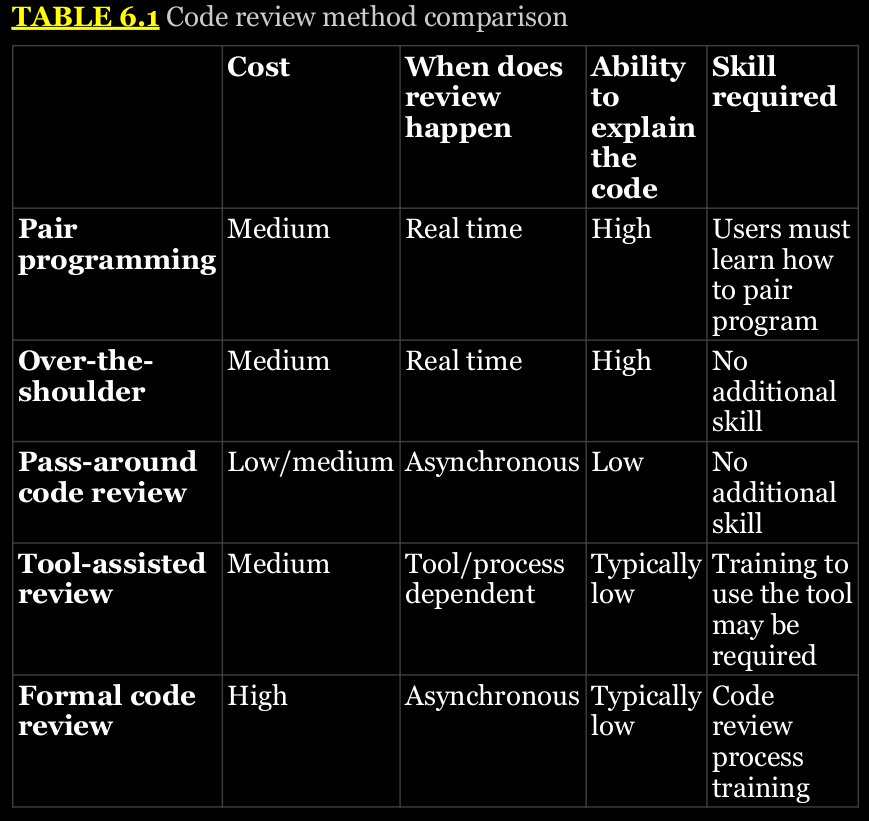
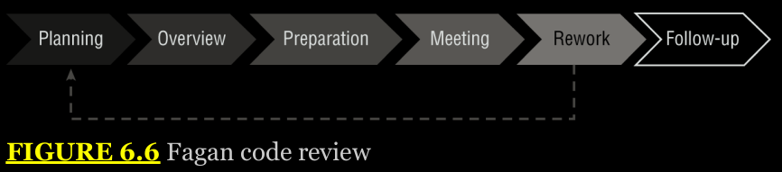

# Chapter 6 Secure Coding

The process of designing, creating, supporting, and maintaining that software is known as the software development life cycle (SDLC). In this chapter, you will learn about major software development life cycle models and the reasons for choosing them, with examples including both the Waterfall and the Spiral models as well as Agile development methods. Finally, you will learn about the common vulnerabilities that exist in software, including client-server and web-based applications. You’ll learn how to recognize and defend against software security exploits.

## Software Assurance Best Practices

Building, deploying, and maintaining software requires security involvement throughout the software’s life cycle. Secure software development life cycles include incorporating security concerns at every stage of the software development process.

## The Software Development Life Cycle

The SDLC is useful for organizations and for developers because it provides a consistent framework to structure workflow and to provide planning for the development process.

  

## Software Development Phases

Regardless of which SDLC or process is chosen by your organization, a few phases appear in most SDLC models:

- The feasibility phase is where initial investigations into whether the effort should occur are conducted. Feasibility also looks at alternative solutions and high-level costs for each solution proposed. It results in a recommendation with a plan to move forward.

- Once an effort has been deemed feasible, it will typically go through an analysis and requirements definition phase. In this phase customer input is sought to determine what the desired functionality is, what the current system or application currently does and what it doesn’t do, and what improvements are desired. Requirements may be ranked to determine which are most critical to the success of the project.

- The design phase includes design for functionality, architecture, integration points and techniques, dataflows, business processes, and any other elements that require design consideration.
 
- The actual coding of the application occurs during the development phase. This phase may involve testing of parts of the software, including unit testing, the testing of small components individually to ensure they function properly.

- Although some testing is likely to occur in the development phase, formal testing with customers or others outside of the development team occurs in the testing and integration phase. Individual units or software components are integrated and then tested to ensure proper functionality. In addition, connections to outside services, data sources, and other integration may occur during this phase. During this phase user acceptance testing (UAT) occurs to ensure that the users of the software are satisfied with its functionality.

- The important task of ensuring that the end users are trained on the software and that the software has entered general use occurs in the training and transition phase. This phase is sometimes called the acceptance, installation, and deployment phase.

- Once a project reaches completion, the application or service will enter what is usually the longest phase: ongoing operations and maintenance. This phase includes patching, updating, minor modifications, and other work that goes into daily support.

- The disposition phase occurs when a product or system reaches the end of its life. Although disposition is often ignored in the excitement of developing new products, it is an important phase for a number of reasons: shutting down old products can produce cost savings, replacing existing tools may require specific knowledge or additional effort, and data and systems may need to be preserved or properly disposed of.

## Code Deployment Environments

- Many organizations use multiple environments for their software and systems development and testing. But the most common environments are as follows:

- The development environment is typically used for developers or other “builders” to do their work. Some workflows provide each developer with their own development environment; others use a shared development environment.

- The test environment is where the software or systems can be tested without impacting the production environment. In some schemes, this is preproduction, whereas in others a separate preproduction staging environment is used. Quality assurance (QA) activities take place in the test environment.

- The staging environment is a transition environment for code that has successfully cleared testing and is waiting to be deployed into production.

- The production environment is the live system. Software, patches, and other changes that have been tested and approved move to production.

## Software Development Models

Formal SDLC models can be very detailed, with specific practices, procedures, and documentation, butmany organizations choose the elements of one or more models that best fit their organizational style, workflow, and requirements.

## Waterfall

The Waterfall methodology is a sequential model in which each phase is followed by the next phase. Phases do not overlap, and each logically leads to the next. A typical six-phase Waterfall process is shown in Figure 6.2. In Phase 1, requirements are gathered and documented. Phase 2 involves analysis intended to build business rules and models. In Phase 3, a software architecture is designed, and coding and integration of the software occurs in Phase 4. Once the software is complete, Phase 5 occurs, with testing and debugging being completed in this phase. Finally the software enters an operational phase, with support, maintenance, and other operational activities happening on an ongoing basis.

Waterfall has been replaced in many organizations because it is seen as relatively inflexible, but it remains in use for complex systems. Since Waterfall is not highly responsive to changes and does not account for internal iterative work, it is typically recommended for development efforts that involve a fixed scope and a known timeframe for delivery and that are using a stable, well-understood technology platform.

## Spiral

The Spiral model uses the linear development concepts from the Waterfall model and adds an iterative process that revisits four phases multiple times during the development life cycle to gather more detailed requirements, design functionality guided by the requirements, and build based on the design. In addition, the Spiral model puts significant emphasis on risk assessment as part of the SDLC, reviewing risks multiple times during the development process.

The Spiral model shown in Figure 6.3 uses four phases, which it repeatedly visits throughout the development life cycle:

- Identification, or requirements gathering, which initially gathers business requirements, system requirements, and more detailed requirements for subsystems or modules as the process continues.

- Design, conceptual, architectural, logical, and sometimes physical or final design.

- Build, which produces an initial proof of concept and then further development releases until the final production build is produced.

- Evaluation, which involves risk analysis for the development project intended to monitor the feasibility of delivering the software from a technical and managerial viewpoint. As the development cycle continues, this phase also involves customer testing and feedback to ensure customer acceptance.

The Spiral model provides greater flexibility to handle changes in requirements as well as external influences such as availability of customer feedback and development staff. It also allows the software development life cycle to start earlier in the process than Waterfall does. Because Spiral revisits its process, it is possible for this model to result in rework or to identify design requirements later in the process that require a significant design change due to more detailed requirements coming to light.

## Agile

Agile software development is an iterative and incremental process, rather than the linear processes that Waterfall and Spiral use. Agile is rooted in the Manifesto for Agile Software Development, a document that has four basic premises:

- Individuals and interactions are more important than processes and tools.

- Working software is preferable to comprehensive documentation.

- Customer collaboration replaces contract negotiation.

- Responding to change is key, rather than following a plan.

Agile methods tend to break up work into smaller units, allowing work to be done more quickly and with less up-front planning. It focuses on adapting to needs, rather than predicting them, with major milestones identified early in the process but subject to change as the project continues to develop. Work is typically broken up into short working sessions, called sprints, that can last days to a few weeks. Figure 6.4 shows a simplified view of an Agile project methodology with multiple sprints conducted.

  

The Agile methodology is based on 12 principles:

- Ensure customer satisfaction via early and continuous delivery of the software.

- Welcome changing requirements, even late in the development process.

- Deliver working software frequently (in weeks rather than months).

- Ensure daily cooperation between developers and business people.

- Projects should be built around motivated individuals who get the support, trust, and environment they need to succeed.

- Face-to-face conversations are the most efficient way to convey information inside the development team.

- Progress is measured by having working software.

- Development should be done at a sustainable pace that can be maintained on an ongoing basis.

- Pay continuous attention to technical excellence and good design.

- Simplicity—the art of maximizing the amount of work not done —is essential.

- The best architectures, requirements, and designs emerge from self-organizing teams.

- Teams should reflect on how to become more effective and then implement that behavior at regular intervals.

These principles drive an SDLC process that is less formally structured than Spiral or Waterfall but that has many opportunities for customer feedback and revision. It can react more nimbly to problems and will typically allow faster customer feedback—an advantage when security issues are discovered.

**DevSecOps and DevOps**

DevOps combines software development and IT operations with the goal of optimizing the SDLC. This is done by using collections of tools called toolchains to improve the coding, building and test, packaging, release, configuration and configuration management, and monitoring elements of a software development life cycle.

Of course, DevOps should have security baked into it as well. The term DevSecOps describes security as part of the DevOps model. In this model, security is a shared responsibility that is part of the entire development and operations cycle. That means integrating security into the design, development, testing, and operational work done to produce applications and services.

The role of security practitioners in a DevSecOps model includes threat analysis and communications, planning, testing, providing feedback, and of course ongoing improvement and awareness responsibilities.

**Continuous Integration and Continuous Deployment**

Continuous integration (CI) is a development practice that checks code into a shared repository on a consistent ongoing basis. In CI environments, this can range from a few times a day to a very frequent process of check-ins and automated builds. The main goal of this approach is to enable the use of automation and scripting to implement automated courses of action that result in continuous delivery of code.

Since continuous integration relies on an automated build process, it also requires automated testing. It is also often paired with continuous deployment (CD) (sometimes called continuous delivery), which rolls out tested changes into production automatically as soon as they have been tested.

  

Using continuous integration and continuous deployment methods requires building continuous validation and automated security testing into the pipeline testing process. It can result in new vulnerabilities being deployed into production and could allow an untrusted or rogue developer to insert flaws into code that is deployed and then remove the code as part of a deployment in the next cycle. This means that logging, reporting, and continuous monitoring must all be designed to fit the CI/CD process.

## Designing and Coding for Security

The first chance to help with software security is in the requirements gathering and design phases, when security can be built in as part of the requirements and then designed in based on those requirements. Later, during the development process, secure coding techniques, code review, and testing can improve the quality and security of the code that is developed.

## Secure Coding Practices

One of the best resources for secure coding practices is the Open Web Application Security Project (OWASP). OWASP is the home of a broad community of developers and security practitioners, and it hosts many community-developed standards, guides, and best practice documents, as well as a multitude of open source tools. OWASP provides a regularly updated list of proactive controls that is useful to review not only as a set of useful best practices, but also as a way to see how web application security threats change from year to year.

Here are OWASP’s top proactive controls for 2018 with brief descriptions:

**Define Security Requirements** Implement security throughout the development process.

**Leverage Security Frameworks and Libraries** Preexisting security capabilities can make securing applications
easier.

**Secure Database Access** Prebuild SQL queries to prevent injection and configure databases for secure access. 

**Encode and Escape Data** Remove special characters.

**Validate All Inputs** Treat user input as untrusted and filter appropriately.

**Implement Digital Identity** Use multifactor authentication, secure password storage and recovery, and session handling.

**Enforce Access Controls** Require all requests to go through access control checks, deny by default, and apply the principle of least privilege.

**Protect Data Everywhere** Use encryption in transit and at rest.

**Implement Security Logging and Monitoring** This helps detect problems and allows investigation after the fact.

**Handle all Errors and Exceptions** Errors should not provide sensitive data, and applications should be tested to ensure that they handle problems gracefully.

## API Security

**Application programming interfaces (APIs)** are interfaces between clients and servers or applications and operating systems that define how the client should ask for information from the server and how the server will respond. This definition means that programs written in any language can implement the API and make requests. APIs are tremendously useful for building interfaces between systems, but they can also be a point of vulnerability if they are not properly secured. API security relies on authentication, authorization, proper data scoping to ensure that too much data isn’t released, rate limiting, input filtering, and appropriate monitoring and logging to remain secure.

## Code Review Models

Reviewing the code that is written for an application provides a number of advantages. It helps to share knowledge of the code, and the experience gained in writing is better than simple documentation alone would be since it provides personal understanding of the code and its functions. It also helps detect problems while enforcing coding best practices and standards by exposing the code to review during its development cycle. Finally, it ensures that multiple members of a team are aware of what the code is supposed to do and how it accomplishes its task.

## Pair Programming

Pair programming is an Agile software development technique that places two developers at one workstation. One developer writes code, while the other developer reviews their code as they write it. This is intended to provide real-time code review, and it ensures that multiple developers are familiar with the code that is written.

## Over-the-Shoulder

Over-the-shoulder code review also relies on a pair of developers, but rather than requiring constant interaction and hand-offs, over- the-shoulder requires the developer who wrote the code to explain the code to the other developer. This approach allows peer review of code and can also assist developers in understanding how the code works, without the relatively high cost of pair programming.

## Pass-Around Code Reviews

Pass-around code review, sometimes known as email pass-around code review, is a form of manual peer review done by sending completed code to reviewers who check the code for issues. Pass- around reviews may involve more than one reviewer, allowing reviewers with different expertise and experience to contribute.

## Tool-Assisted Reviews

Tool-assisted code reviews rely on formal or informal software-based tools to conduct code reviews. Tools like Atlassian’s Crucible collaborative code review tool, Codacy’s static code review tool, and Phabricator’s Differential code review tool are all designed to improve the code review process.

## Choosing a Review Method

  

The exam objectives simply list “manual code review,” without mentioning the review methods we have covered here. You’ll want to have the concept of code reviews in mind as you take the exam, but you may not be asked to explain all the methods in depth. As with some of the other topics we cover, we think that it is useful to be aware of these techniques as security professionals who may encounter them or may need to help your organization choose the right option.

#### `Be sure that you understand these issues, because they are likely to appear on exam questions!`

## Fagan Inspection

Fagan inspection is a form of structured, formal code review intended to find a variety of problems during the development process. Fagan inspection specifies entry and exit criteria for processes, ensuring that a process is not started before appropriate diligence has been performed, and also making sure that there are known criteria for moving to the next phase.

The Fagan inspection process shown in Figure 6.6 shows the six phases of a typical process:

- Planning, including preparation of materials, attendees, and location.

- Overview, which prepares the team by reviewing the materials and assigning roles such as coder, reader, reviewer, and moderator.

- Preparation, which involves reviewing the code or other item being inspected and documents any issues or questions they may have.
    
- Meeting to identify defects based on the notes from the preparation phase.

- Rework to resolve issues.
  
- Follow-up by the moderator to ensure that all issues identified have been found and that no new defects were created during the resolution process.

  

## Software Security Testing

A broad variety of manual and automatic testing tools and methods are available to security professionals and developers. Fortunately, automated tools have continued to improve, providing an easier way to verify that code is more secure. Over the next few pages, we will review some of the critical software security testing methods and tools available today.

## Analyzing and Testing Code

It is important to be able to analyze the code to understand what the code does, how it performs that task, and where flaws may occur in the program itself. This is often done via static or dynamic code analysis along with testing methods like fuzzing. Once changes are made to code and it is deployed, it must be regression tested to ensure that the fixes put in place didn’t create new security issues!

## Static Code Analysis

Static code analysis (sometimes called source code analysis) is conducted by reviewing the code for an application. Unlike many other methods, static analysis does not run the program; instead, it focuses on understanding how the program is written and what the code is intended to do. Static code analysis can be conducted using automated tools or manually by reviewing the code—a process sometimes called “code understanding.” Automated static code analysis can be very effective at finding known issues, and manual static code analysis helps to identify programmer-induced errors.

## Dynamic Code Analysis

Dynamic code analysis relies on execution of the code while providing it with input to test the software. Much  like static code analysis, dynamic code analysis may be done via automated tools or manually, but there is a strong preference for automated testing due to the volume of tests that need to be conducted in most dynamic code testing processes.

## Fuzzing

Fuzz testing, or fuzzing, involves sending invalid or random data to an application to test its ability to handle unexpected data. The application is monitored to determine if it crashes, fails, or responds in an incorrect manner. Fuzzing is typically automated due to the large amount of data that a fuzz test involves, and it is particularly useful for detecting input validation and logic issues as well as memory leaks and error handling. Unfortunately, fuzzing tends to only identify simple problems—it does not account for complex logic or business process issues, and it may not provide complete code coverage if its progress is not monitored.

## Injection Vulnerabilities

We’ll look at a number of different vulnerability categories in this chapter. **Injection vulnerabilities** are among the primary mechanisms that attackers use to break through a web application and gain access to the systems supporting that application. These vulnerabilities allow an attacker to supply some type of code to the web application as input and trick the web server into either executing that code or supplying it to another server to execute.

## SQL Injection Attacks

Web applications often receive input from users and use it to compose a database query that provides results that are sent back to a user.

PAG 248

