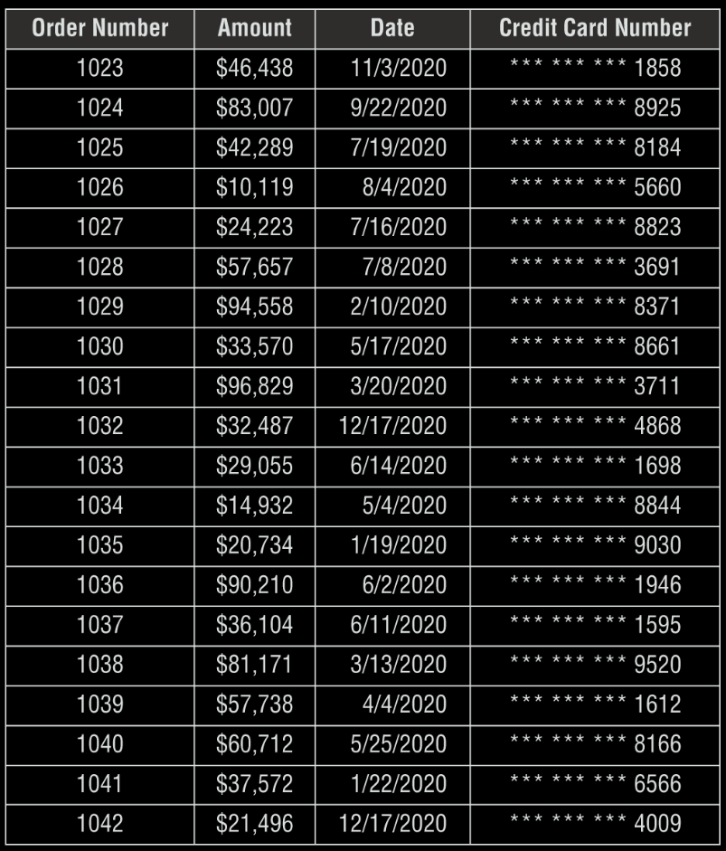
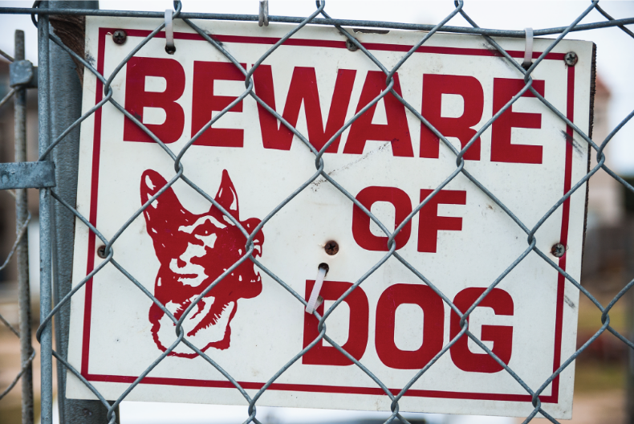

1- Matt is updating the organization's threat assessment process. What category of control is Matt implementing?

A. Operational

B. Technical

C. Corrective

D. Managerial

1. D. Managerial controls are procedural mechanisms that focus on the mechanics of the risk management process. Threat assessment is an example of one of these activities.

2- Jade's organization recently suffered a security breach that affected stored credit card data. Jade's primary concern is the fact that the organization is subject to sanctions for violating the provisions of the Payment Card Industry Data Security Standard. What category of risk is concerning Jade?

A. Strategic

B. Compliance

C. Operational

D. Financial

2. B. The breach of credit card information may cause many different impacts on the organization, including compliance, operational, and financial risks. However, in this scenario, Jade's primary concern is violating PCI DSS, making his concern a compliance risk.

3- Chris is responding to a security incident that compromised one of his organization's web servers. He believes that the attackers defaced one or more pages on the website. What cybersecurity objective did this attack violate?

A. Confidentiality

B. Nonrepudiation

C. Integrity

D. Availability

3. C. The defacement of a website alters content without authorization and is, therefore, a violation of the integrity objective. The attackers may also have breached the confidentiality or availability of the website, but the scenario does not provide us with enough information to draw those conclusions.

4- Gwen is exploring a customer transaction reporting system and discovers the table shown here. What type of data minimization has most likely been used on this table?

  

A. Destruction

B. Masking

C. Tokenization

D. Hashing

4. B. In this case, the first 12 digits of the credit card have been removed and replaced with asterisks. This is an example of data masking.

5- Tonya is concerned about the risk that an attacker will attempt to gain access to her organization's database server. She is searching for a control that would discourage the attacker from attempting to gain access. What type of security control is she seeking to implement?

A. Preventive

B. Detective

C. Corrective

D. Deterrent

5. D. Deterrent controls are designed to prevent an attacker from attempting to violate security policies in the first place. Preventive controls would attempt to block an attack that was about to take place. Corrective controls would remediate the issues that arose during an attack.

6- Greg is implementing a data loss prevention system. He would like to ensure that it protects against transmissions of sensitive information by guests on his wireless network. What DLP technology would best meet this goal?

A. Watermarking

B. Pattern recognition

C. Host-based

D. Network-based

6. D. In this case, Greg must use a network-based DLP system. Host-based DLP requires the use of agents, which would not be installed on guest systems. Greg may use watermarking and/or pattern recognition to identify the sensitive information. but he must use network-based DLP to meet his goal.

7- What term best describes data that is being sent between two systems over a network connection?
A. Data at rest

B. Data in motion

C. Data in processing

D. Data in use

7. B. Data being sent over a network is data in motion. Data at rest is stored data that resides on hard drives, tapes, in the cloud, or on other storage media. Data in processing, or data in use, is data that is actively in use by a computer system.

8- Tina is tuning her organization's intrusion prevention system to prevent false positive alerts. What type of control is Tina implementing?

A. Technical control

B. Physical control

C. Managerial control

D. Operational control

8. A. Technical controls enforce confidentiality, integrity, and availability in the digital space. Examples of technical securitycontrols include firewall rules, access control lists, intrusion prevention systems, and encryption.

9- Which one of the following is not a common goal of a cybersecurity attacker?

A. Disclosure

B. Denial

C. Alteration

D. Allocation

9. D. The three primary goals of cybersecurity attackers are disclosure, alteration, and denial. These map directly to the three objectives of cybersecurity professionals: confidentiality, integrity, and availability.

10- Tony is reviewing the status of his organization's defenses against a breach of their file server. He believes that a compromise of the file server could reveal information that would prevent the company from continuing to do business. What term best describes the risk that Tony is considering?

A. Strategic

B. Reputational

C. Financial

D. Operational

10. A. The risk that Tony is contemplating could fit any one of these categories. However, his primary concern is that the company may no longer be able to do business if the risk materializes. This is a strategic risk.

11- Which one of the following data elements is not commonly associated with identity theft?

A. Social Security number

B. Driver's license number

C. Frequent flyer number

D. Passport number

11. C. Although it is possible that a frequent flyer account number, or any other account number for that matter, could be used in identity theft, it is far more likely that identity thieves would use core identity documents. These include drivers' licenses, passports, and Social Security numbers.

12- What term best describes an organization's desired security state?

A. Control objectives

B. Security priorities

C. Strategic goals

D. Best practices

12. A. As an organization analyzes its risk environment, technical and business leaders determine the level of protection required t preserve the confidentiality, integrity, and availability of their information and systems. They express these requirements by writing the control objectives that the organization wishes to achieve. These control objectives are statements of a desired security state.

13- Lou mounted the sign below on the fence surrounding his organization's datacenter. What control type best describes this control?

  

A. Compensating

B. Detective

C. Physical

D. Deterrent

13. A. This question is a little tricky. The use of an actual guard dog could be considered a deterrent, physical, or detective control. It could even be a compensating control in some circumstances. However, the question asks about the presence of a sign and does not state that an actual dog is used. The sign only has value as a deterrent control. Be careful when facing exam questions like this to read the details of the question.

14-  What technology uses mathematical algorithms to render information unreadable to those lacking the required key?

A. Data loss prevention

B. Data obfuscation

C. Data minimization

D. Data encryption

14. D. Encryption technology uses mathematical algorithms to protect information from prying eyes, both while it is in transit over a network and while it resides on systems. Encrypted data is unintelligible to anyone who does not have access to the appropriate decryption key, making it safe to store and transmit encrypted data over otherwise insecure means.

15- Greg recently conducted an assessment of his organization's security controls and discovered a potential gap: the organization does not use full-disk encryption on laptops. What type of control gap exists in this case?

A. Detective

B. Corrective

C. Deterrent

D. Preventive

15. D. The use of full-disk encryption is intended to prevent a security incident from occurring if a device is lost or stolen. Therefore, this is a preventive control gap.

16- What compliance regulation most directly affects the operations of a healthcare provider?

A. HIPAA

B. PCI DSS

C. GLBA

D. SOX

16. A. Although a health-care provider may be impacted by any of these regulations, the Health Insurance Portability and Accountability Act (HIPAA) provides direct regulations for the security and privacy of protected health information and would have the most direct impact on a health-care provider.

17- Nolan is writing an after action report on a security breach that took place in his organization. The attackers stole thousands of customer records from the organization's database. What cybersecurity principle was most impacted in this breach?

A. Availability

B. Nonrepudiation

C. Confidentiality

D. Integrity

17. C. The disclosure of sensitive information to unauthorized individuals is a violation of the principle of confidentiality.

18- Which one of the following objectives is not one of the three main objectives that information security professionals must achieve to protect their organizations against cybersecurity threats?

A. Integrity

B. Nonrepudiation

C. Availability

D. Confidentiality

18. B. The three primary objectives of cybersecurity professionals are confidentiality, integrity, and availability.

19- Which one of the following data protection techniques is reversible when conducted properly?

A. Tokenization

B. Masking

C. Hashing

D. Shredding

19. A. Tokenization techniques use a lookup table and are designed to be reversible. Masking and hashing techniques replace the data with values that can't be reversed back to the original data if performed properly. Shredding, when conducted properly, physically destroys data so that it may not be recovered.

20- Which one of the following statements is not true about compensating controls under PCI DSS?

A. Controls used to fulfill one PCI DSS requirement may be used to compensate for the absence of a control needed to meet another requirement.

B. Controls must meet the intent of the original requirement.

C. Controls must meet the rigor of the original requirement.

D. Compensating controls must provide a similar level of defense as the original requirement.

20. A. PCI DSS compensating controls must be “above and beyond” other PCI DSS requirements. This specifically bans the use of a control used to meet one requirement as a compensating control for another requirement.