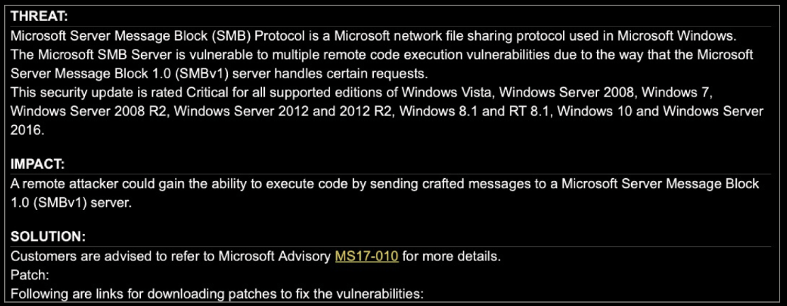

1- Which one of the following security assessment techniques assumes that an organization has already been compromised and searches for evidence of that compromise?

A. Vulnerability scanningB. Penetration testing

C. Threat hunting

D. War driving

1. C. Threat hunting is an assessment technique that makes an assumption of compromise and then searches the organization for indicators of compromise that confirm the assumption. Vulnerability scanning, penetration testing, and war driving are all assessment techniques that probe for vulnerabilities but do not assume that a compromise has already taken place.

2- Renee is configuring her vulnerability management solution to perform credentialed scans of servers on her network. What type of account should she provide to the scanner?

A. Domain administrator

B. Local administrator

C. Root

D. Read-only

2. D. Credentialed scans only require read-only access to target servers. Renee should follow the principle of least privilege and limit the access available to the scanner.

3- Ryan is planning to conduct a vulnerability scan of a business-critical system using dangerous plug-ins. What would be the best approach for the initial scan?

A. Run the scan against production systems to achieve the most realistic results possible.

B. Run the scan during business hours.

C. Run the scan in a test environment.

D. Do not run the scan to avoid disrupting the business.

3. C. Ryan should first run his scan against a test environment to identify likely vulnerabilities and assess whether the scan itself might disrupt business activities.

4- Which one of the following values for the CVSS attack complexity metric would indicate that the specified attack is simplest to exploit?

A. High

B. Medium

C. Low

D. Severe

4. C. An attack complexity of “low” indicates that exploiting the vulnerability does not require any specialized conditions.

5- Tara recently analyzed the results of a vulnerability scan report and found that a vulnerability reported by the scanner did not exist because the system was actually patched as specified. What type of error occurred?

A. False positiveB. False negative

C. True positive

D. True negative

5. A. A false positive error occurs when the vulnerability scanner reports a vulnerability that does not actually exist.

6- Brian ran a penetration test against a school's grading system and discovered a flaw that would allow students to alter their grades by exploiting a SQL injection vulnerability. What type of control should he recommend to the school's cybersecurity team to prevent students from engaging in this type of activity?

A. Confidentiality

B. Integrity

C. Alteration

D. Availability

6. B. By allowing students to change their own grades, this vulnerability provides a pathway to unauthorized alteration of information. Brian should recommend that the school deploy integrity controls that prevent unauthorized modifications.

7- Which one of the following security assessment tools is least likely to be used during the reconnaissance phase of a penetration test?

A. Nmap

B. Nessus

C. Metasploit

D. Nslookup

7. C. Nmap is a port scanning tool used to enumerate open network ports on a system. Nessus is a vulnerability scanner designed to detect security issues on a system. Nslookup is a DNS information gathering utility. All three of these tools may be used to gather information and detect vulnerabilities. Metasploit is an exploitation framework used to execute and attack and would be better suited for the Attacking and Exploiting phase of a penetration test.

8- During a vulnerability scan, Brian discovered that a system on his network contained this vulnerability:What security control, if deployed, would likely have addressed this issue?

  

A. Patch management

B. File integrity monitoring

C. Intrusion detection

D. Threat hunting

8. A. This vulnerability is corrected by a patch that was released by Microsoft in 2017. A strong patch management program would have identified and remediated the missing patch. 

9- Which one of the following tools is most likely to detect an XSS vulnerability?

A. Static application test

B. Web application vulnerability scanner

C. Intrusion detection system

D. Network vulnerability scanner

9.  B. Intrusion detection systems do not detect vulnerabilities; they detect attacks. The remaining three tools could all possiblydiscover a cross-site scripting (XSS) vulnerability, but a web application vulnerability scanner is the most likely to detect it because it is specifically designed to test web applications.

10- During a penetration test, Patrick deploys a toolkit on a compromised system and uses it to gain access to other systems on the same network. What term best describes this activity? 
A. Lateral movement

B. Privilege escalation

C. Footprinting

D. OSINT

10. A. Moving from one compromised system to other systems on the same network is known as lateral movement. Privilege escalation attacks increase the level of access that an attacker has to an already compromised system. Footprinting and OSINT are reconnaissance techniques.

11- Kevin is participating in a security exercise for his organization. His role in the exercise is to use hacking techniques to attempt to gain access to the organization's systems. What role is Kevin playing in this exercise?

A. Red team

B. Blue team

C. Purple team

D. White team

11. A. Offensive hacking is used by red teams as they attempt to gain access to systems on the target network. Blue teams are responsible for managing the organization's defenses. White teams serve as the neutral moderators of the exercise. Purple teaming is conducted after an exercise to bring together the red and blue teams for knowledge sharing.

12- Which one of the following assessment techniques is designed to solicit participation from external security experts and reward them for discovering vulnerabilities?A. Threat hunting

B. Penetration testing

C. Bug bounty

D. Vulnerability scanning

12. C. Bug bounty programs are designed to allow external security experts to test systems and uncover previously unknown vulnerabilities. Bug bounty programs offer successful testers financial rewards to incentivize their participation.

13- Kyle is conducting a penetration test. After gaining access to an organization's database server, he installs a backdoor on the server to grant himself access in the future. What term best describes this action?

A. Privilege escalation

B. Lateral movement

C. Maneuver

D. Persistence

13. D. Backdoors are a persistence tool, designed to make sure that the attacker's access persists after the original vulnerability is remediated. Kyle can use this backdoor to gain access to the system in the future, even if the original exploit that he used to gain access is no longer effective.

14- Which one of the following techniques would be considered passive reconnaissance?

A. Port scans

B. Vulnerability scans

C. WHOIS lookups

D. Footprinting

14. C. WHOIS lookups use external registries and are an example of open source intelligence (OSINT), which is a passive reconnaissance technique. Port scans, vulnerability scans, and footprinting all require active engagement with the target and are, therefore, active reconnaissance.

15- Which element of the SCAP framework can be used to consistently describe vulnerabilities?

A. CPE

B. CVE

C. CVSS

D. CCE

15. B. Common Vulnerabilities and Exposures (CVE) provides a standard nomenclature for describing security-related software flaws. Common Configuration Enumeration (CCE) provides a standard nomenclature for discussing system configuration issues. Common Platform Enumeration (CPE) provides a standard nomenclature for describing product names and versions. The Common Vulnerability Scoring System (CVSS)provides a standardized approach for measuring and describing the severity of security-related software flaws.

16- Bruce is conducting a penetration test for a client. The client provided him with details of their systems in advance. What type of test is Bruce conducting?

A. Gray-box test

B. Blue-box testC. White-box test

D. Black-box test

16. C. White-box tests are performed with full knowledge of the underlying technology, configurations, and settings that make up the target. Black-box tests are intended to replicate what an attacker would encounter. Testers are not provided with access to or information about an environment, and instead, they must gather information, discover vulnerabilities, and make their way through an infrastructure or systems like an attacker would. Gray-box tests are a blend of black-box and white-box testing. Blue-box tests are not a type of penetration test.

17- Lila is working on a penetration testing team and she is unsure whether she is allowed to conduct social engineering as part of the test. What document should she consult to find this information?

A. Contract

B. Statement of work

C. Rules of engagement

D. Lessons learned report

17. C. The rules of engagement provide technical details on the parameters of the test. This level of detail would not normally be found in a contract or statement of work. The lessons learned report is not produced until after the test.

18- Grace would like to determine the operating system running on a system that she is targeting in a penetration test. Which one of the following techniques will most directly provide her with this information?

A. Port scanning

B. Footprinting

C. Vulnerability scanning

D. Packet capture

18. B. All of these techniques might provide Grace with information about the operating system running on a device. However, footprinting is a technique specifically designed to elicit this information.

19- Kevin recently identified a new security vulnerability and computed its CVSS base score as 6.5. Which risk category would this vulnerability fall into?

A. Low

B. Medium

C. High

D. Critical

19. B. Vulnerabilities with CVSS base scores between 4.0 and 6.9 fit into the medium risk category.

20- Which one of the CVSS metrics would contain information about the type of account access that an attacker must have to execute an attack?

A. AV

B. CC. PR

D. AC

20. C. The privileges required (PR) metric indicates the type of system access that an attacker must have to execute the attack.