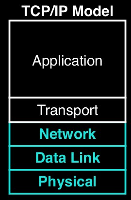
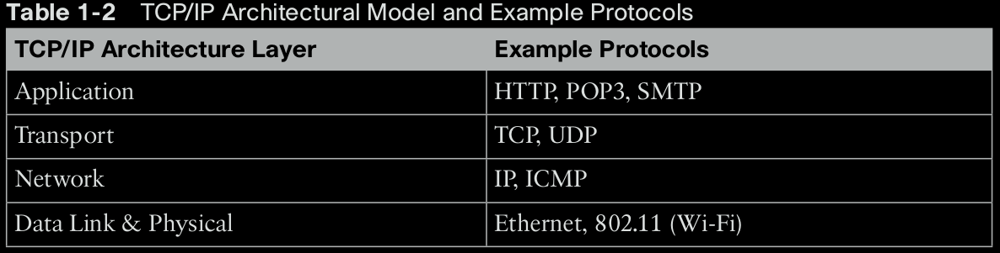
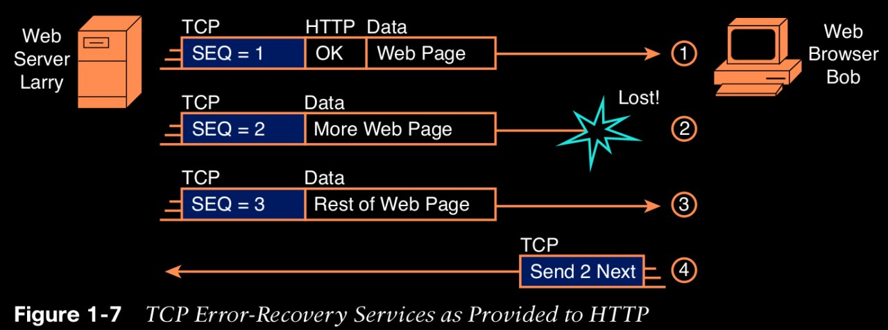
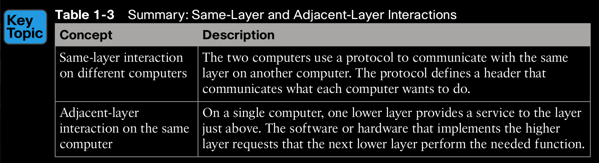
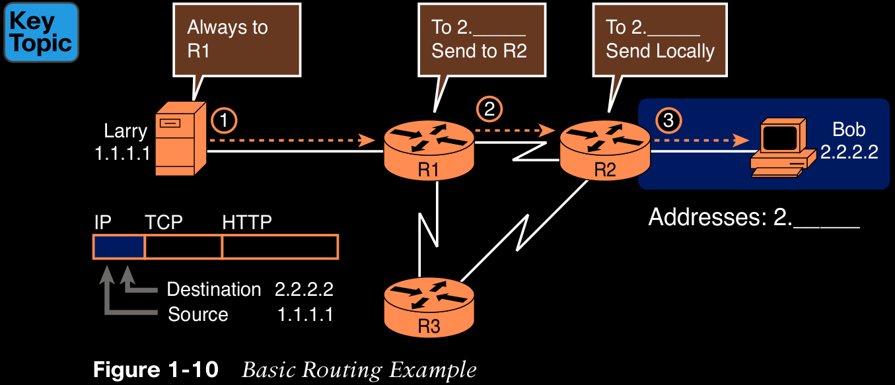
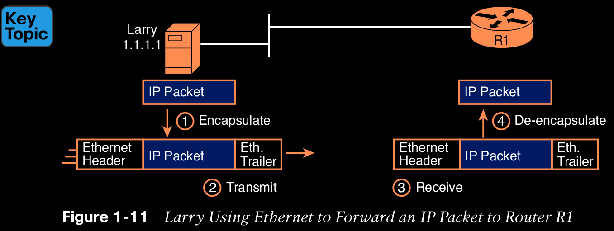
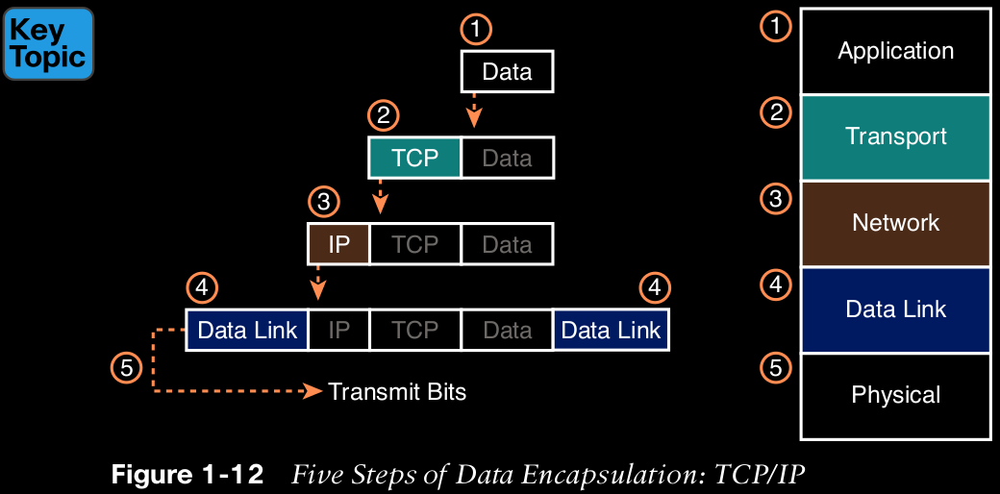
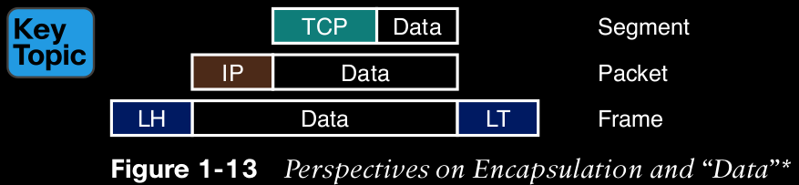
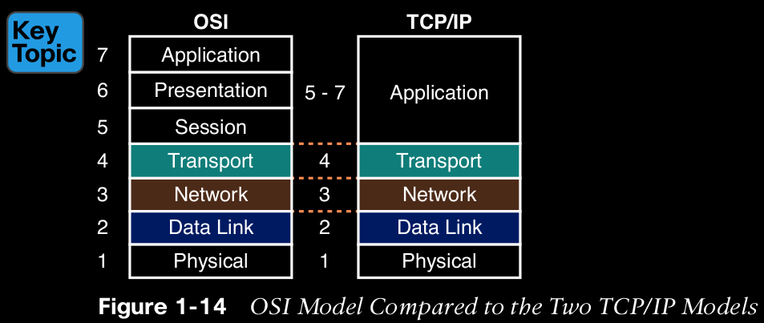

# Chapter 1 Introduction to TCP/IP Networking

  

**The bottom layer focuses on how to transmit bits over each individual link.** The data-link layer focuses on sending data over one type of physical link: for instance, networks use different data-link protocols for Ethernet LANs versus wireless LANs. **The network layer focuses on delivering data over the entire path from the original sending computer to the final destination computer.** And the top two layers focus more on the applications that need to send and receive data.

  

## TCP/IP Application Layer

TCP/IP application layer protocols provide services to the application software running on a computer. For example, application protocol HTTP defines how web browsers can pull the contents of a web page from a web server. **Its an interface between software running on a computer and the network itself.**

## TCP/IP Transport Layer

The two most commonly used transport layer protocols are the Transmission Control Protocol (TCP) and the User Datagram Protocol (UDP).

## TCP Error Recovery Basics

TCP/IP needs a mechanism to guarantee delivery of data across a network. To recover from errors, TCP uses the concept of acknowledgments.

  

Figure 1-7 shows web server Larry sending a web page to web browser Bob, using three separate messages. Note that this figure shows the same HTTP headers as Figure 1-6, but it also shows a TCP header. The TCP header shows a sequence number (SEQ) with each message. In this example, the network has a problem, and the network fails to deliver the TCP message with sequence number 2. When Bob receives messages with sequence numbers 1 and 3, but does not receive a message with sequence number 2, Bob realizes that message 2 was lost. That realization by Bob’s TCP logic causes Bob to send a TCP segment back to Larry, asking Larry to send message 2 again.

## Same-Layer and Adjacent-Layer Interactions

What is adjacent-layer interaction?

On a single computer, one lower layer provides a service to the layer just above.

What is same-layer interaction?
The two computers use a protocol to communcate with the same layer on another computer.

  

## TCP/IP Network Layer

The application layer includes many protocols. The transport layer includes fewer protocols, most notably, TCP and UDP. The TCP/IP network layer includes a small number of protocols, but only one major protocol: the Internet Protocol (IP). In fact, the name TCP/IP is simply the names of the two most common protocols (TCP and IP) separated by a /. IP provides several features, most importantly, addressing and routing.

## IP Routing Basics
The TCP/IP network layer, using the IP protocol, provides a service of forwarding IP packets from one device to another. 

  

At Step 2, Router R1 receives the IP packet, and R1’s IP process makes a decision. R1 looks at
the destination address (2.2.2.2), compares that address to its known IP routes, and chooses
to forward the packet to Router R2. This process of forwarding the IP packet is called IP routing (or simply routing).

## TCP/IP Data-Link and Physical Layers

The TCP/IP model’s data-link and physical layers define the protocols and hardware required to deliver data across some physical network. The physical layer defines the cabling and energy (for example, electrical signals) that flow over the cables. The rules and conventions when sending data exist in the data-link layer of the TCP/IP model.

  

Figure 1-11 shows four steps. The first two occur on Larry, and the last two occur on Router R1, as follows:
Step 1. Larry encapsulates the IP packet between an Ethernet header and Ethernet trailer, creating an Ethernet frame.
Step 2. Larry physically transmits the bits of this Ethernet frame, using electricity flowing over the Ethernet cabling.
Step 3. Router R1 physically receives the electrical signal over a cable and re-creates the same bits by interpreting the meaning of the electrical signals.
Step 4. Router R1 de-encapsulates the IP packet from the Ethernet frame by removing and discarding the Ethernet header and trailer. By the end of this process, Larry and R1 have worked together to deliver the packet from Larry to Router R1.

In short: 

The physical layer have functions related to the physical transmission of the data.

The data-link layer have functions related to the rules that control the use of the physical media.

## Data Encapsulation Terminology

The process by which a TCP/IP host sends data can be viewed as a five-step process. The first four steps relate to the encapsulation performed by the four TCP/IP layers, and the last step is the actual physical transmission of the data by the host. In fact, if you use the five-layer TCP/IP model, one step corresponds to the role of each layer. The steps are summarized in the following list:

Step 1. Create and encapsulate the application data with any required application layer headers. For example, the HTTP OK message can be returned in an HTTP header, followed by part of the contents of a web page.
Step 2. Encapsulate the data supplied by the application layer inside a transport layer header. For end-user applications, a TCP or UDP header is typically used.
Step 3. Encapsulate the data supplied by the transport layer inside a network layer (IP) header. IP defines the IP addresses that uniquely identify each computer.
Step 4. Encapsulate the data supplied by the network layer inside a data-link layer header and trailer. This layer uses both a header and a trailer.
Step 5. Transmit the bits. The physical layer encodes a signal onto the medium to transmit the frame.

## Names of TCP/IP Messages

Each term refers to a different layer:

> Segment for the transport layer

> Packet for the network layer

> Frame for the link layer. 

Figure 1-13 shows each layer along with the associated term.

Figure 1-13 also shows the encapsulated data as simply “data” When focusing on the work done by a particular layer, the encapsulated data typically is unimportant.

## OSI Networking Model and Terminology

  

Note that the TCP/IP model in use today, on the right side of the figure, uses the exact same layer names as OSI at the lower layers. For the purposes of this book, know the mapping between the five-layer TCP/IP model and the seven-layer OSI model shown in Figure 1-14, and know that layer number references to Layer 7 really do match the application layer of TCP/IP as well.

## OSI Data Encapsulation Terminology

Like TCP/IP, each OSI layer asks for services from the next lower layer. To provide the services, each layer makes use of a header and possibly a trailer. The lower layer encapsulates the higher layer’s data behind a header. OSI uses a more generic term to refer to messages, rather than frame, packet, and segment. OSI uses the term protocol data unit (PDU). A PDU represents the bits that include the headers and trailers for that layer, as well as the encapsulated data.

