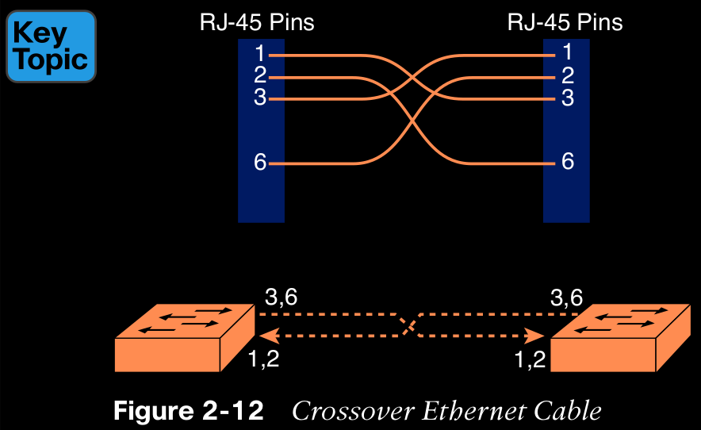

# Chapter 2 Fundamentals of Ethernet LANs

The standards, defined by the Institute of Electrical and Electronics Engineers (IEEE), define the cabling, the connectors on the ends of the cables, the protocol rules, and everything else required to create an Ethernet LAN.

## Typical SOHO LANs (small office/home office)

A LAN needs a device called an Ethernet LAN switch, which provides many physical ports into which cables can be connected.

Wireless LANs, defined by the IEEE using standards that begin with 802.11  

## Typical Enterprise LANs

## The Variety of Ethernet Physical Layer Standards

All these Ethernet standards come from the IEEE and include the number 802.3 as the beginning part of the standard name. The IEEE also uses more meaningful shortcut names that identify the speed, as well as a clue about whether the cabling is UTP (with a suffix that includes T) or fiber (with a suffix that includes X).

  

## Consistent Behavior over All Links Using the Ethernet Data-Link Layer

Although Ethernet includes many physical layer standards, Ethernet acts like a single LAN technology because it uses the same data-link layer standard over all types of Ethernet phys- ical links.

Figure 2-4 shows an example of the process. In this case, PC1 sends an Ethernet frame to PC3. The frame travels over a UTP link to Ethernet switch SW1, then over fiber links to Ethernet switches SW2 and SW3, and finally over another UTP link to PC3. Note that the bits actually travel at four different speeds in this example: 10 Mbps, 1 Gbps, 10 Gbps, and 100 Mbps respectively.

## Building Physical Ethernet LANs with UTP

> Unshielded Twisted Pair (UTP)

## Transmitting Data Using Twisted Pairs

Ethernet sends data over UTP cables that creates eletrical circuits where a electrical signal communicate 1s and 0s.

## Breaking Down a UTP Ethernet Link

The RJ-45 connector has eight physical locations into which the eight wires in the cable can be inserted, called pin positions, or simply pins.

The 10BASE-T and 100BASE-T standards require two pairs of wires, while the 1000BASE-T standard requires four pairs.

Network interface card (NIC) 

## UTP Cabling Pinouts for 10BASE-T and 100BASE-T

#### Straight-Through Cable Pinout

10BASE-T and 100BASE-T use two pairs of wires in a UTP cable, one for each direction, as shown in Figure 2-9. The figure shows four wires, all of which sit inside a single UTP cable that connects a PC and a LAN switch. In this example, the PC on the left transmits using the top pair, and the switch on the right transmits using the bottom pair.

  

As a rule, Ethernet NIC transmitters use the pair connected to pins 1 and 2; the NIC receivers use a pair of wires at pin positions 3 and 6. LAN switches, knowing those facts about what Ethernet NICs do, do the opposite: Their receivers use the wire pair at pins 1 and 2, and their transmitters use the wire pair at pins 3 and 6.

An Ethernet straight-through cable connects the wire at pin 1 on one end of the cable to pin 1 at the other end of the cable; the wire at pin 2 needs to connect to pin 2 on the other end of the cable; pin 3 on one end connects to pin 3 on the other, and so on, as seen in Figure 2-10. Also, it uses the wires in one wire pair at pins 1 and 2, and another pair at pins 3 and 6.

  

Figure 2-11 shows one final perspective on the straight-through cable pinout.

  

When two like devices connect to an Ethernet link, they both transmit on the same pins. In that case, you then need a crossover cable. The crossover cable pinout crosses the pair at the transmit pins on each device to the receive pins on the opposite device. 

The two switches both transmit on the pair at pins 3 and 6, and they both receive on the pair at pins 1 and 2. So, the cable must connect a pair at pins 3 and 6 on each side to pins 1 and 2 on the other side, connecting to the other node’s receiver logic.

## Choosing the Right Cable Pinouts

The key is to know whether a device acts like a PC NIC, transmitting at pins 1 and 2, or like a switch, transmitting at pins 3 and 6. Then, just apply the following logic:

	Crossover cable: If the endpoints transmit on the same pin pair 
	
	Straight-through cable: If the endpoints transmit on different pin pairs

 

## UTP Cabling Pinouts for 1000BASE-T

1000BASE-T requires four wire pairs and it uses more advanced electronics that allow both ends to transmit and receive simultaneously on each wire pair. work almost identically to the earlier standards, adding details for the additional two pairs.

  

## Building Physical Ethernet LANs with Fiber

### Fiber Cabling Transmission Concepts

Fiber-optic cabling uses fiberglass, as the medium through which light passes, varying that light over time to encode 0s and 1s.

  

The three outer layers of the cable protect the interior of the cable while the inner **cladding** and **core** work together to create the environment to allow transmission of light over the cable. A light source, called the optical transmitter, shines a light into the core. Light can pass through the core; however, light reflects off the cladding back into the core.

The figure shows the normal operation of a multimode fiber characterized by the fact that the cable allows for multiple angles (modes) of light waves entering the core.

In contrast, single-mode fiber uses a smaller-diameter core around one-fifth the diameter of common multimode cables (see Figure 2-17). To transmit light into a much smaller core, a laser-based transmitter sends light at a single angle (hence the name single-mode).

  

## Using Fiber with Ethernet

  

  

## Sending Data in Ethernet Networks

## Ethernet Data-Link Protocols

The Ethernet data-link protocol defines the Ethernet frame: an Ethernet header at the front, the encapsulated data in the middle, and an Ethernet trailer at the end. 

  

## Ethernet Addressing

Ethernet addresses, also called Media Access Control (MAC) addresses, are 6-byte-long (48-bit-long) binary numbers. For convenience, most computers list MAC addresses as 12-digit hexadecimal numbers.

The IEEE also calls these universal MAC addresses global MAC addresses. Most MAC addresses represent a single NIC or other Ethernet port, so these addresses are often called a unicast Ethernet address.

The manufacturer agrees to give all NICs a MAC address that begins with its assigned 3-byte OUI. The manufacturer also assigns a unique value for the last 3 bytes, a number that manufacturer has never used with that OUI. As a result, the MAC address of every device in the universe is unique.

  

In addition to unicast addresses, Ethernet also uses group addresses. Group addresses identify more than one LAN interface card. A frame sent to a group address might be delivered to a small set of devices on the LAN, or even to all devices on the LAN. In fact, the IEEE defines two general categories of group addresses for Ethernet:

Broadcast address: Frames sent to this address should be delivered to all devices on the Ethernet LAN. It has a value of FFFF.FFFF.FFFF.

Multicast addresses: Frames sent to a multicast Ethernet address will be copied and forwarded to a subset of the devices on the LAN that volunteers to receive frames sent to a specific multicast address.

  

## Identifying Network Layer Protocols with the Ethernet Type Field

Basically, the Type field identifies the type of network layer (Layer 3) packet that sits inside the Ethernet frame. For example, a host can send one Ethernet frame with an IPv4 packet and the next Ethernet frame with an IPv6 packet. Each frame would have a different Ethernet Type field value, using the values reserved by the IEEE, as shown in Figure 2-21.

  

## Error Detection with FCS

Ethernet, like most data-link protocols, uses a field in the data-link trailer for the purpose of error detection.

The Ethernet Frame Check Sequence (FCS) field in the Ethernet trailer—the only field in the Ethernet trailer—gives the receiving node a way to compare results with the sender, to discover whether errors occurred in the frame. The sender applies a complex math formula to the frame before sending it, storing the result of the formula in the FCS field. The receiver applies the same math formula to the received frame. The receiver then compares its own results with the sender’s results. If the results are the same, the frame did not change; otherwise, an error occurred, and the receiver discards the frame.

## Sending Ethernet Frames with Switches and Hubs

The use of more modern switches allows the use of full-duplex logic, which is much faster and simpler than half-duplex logic, which is required when using hubs.

## Sending in Modern Ethernet LANs Using Full Duplex

  

Full duplex means that that the NIC or switch port has no half-duplex restrictions. So, to understand full duplex, you need to understand half duplex, as follows:

>**Half duplex:** The device must wait to send if it is currently receiving a frame; in other words, it cannot send and receive at the same time.

>**Full duplex:** The device does not have to wait before sending; it can send and receive at the same time.

So, with all PCs and LAN switches, and no LAN hubs, all the nodes can use full duplex. All nodes can send and receive on their port at the same instant in time.

## Using Half Duplex with LAN Hubs

When an electrical signal comes in one hub port, the hub repeats that electrical signal out all other ports (except the incoming port). By doing so, the data reaches all the rest of the nodes connected to the hub, so the data hopefully reaches the correct destination. The hub has no concept of Ethernet frames, of addresses, making decisions based on those addresses, and so on. The downside of using LAN hubs is that if two or more devices transmitted a signal at the same instant, the electrical signal collides and becomes garbled. The hub repeats all received electrical signals, even if it receives multiple signals at the same time.

If you replace the hub in Figure 2-23 with a LAN switch, the  switch prevents the collision on the left. The switch operates as a Layer 2 device, meaning that it looks at the data-link header and trailer. A switch would look at the MAC addresses, and even if the switch needed to forward both frames to Larry on the left, the switch would send one frame and queue the other frame until the first frame was finished.

Now back to the issue created by the hub’s logic: collisions. To prevent these collisions, the Ethernet nodes must use half-duplex logic instead of full-duplex logic. A problem occurs only when two or more devices send at the same time; half-duplex logic tells the nodes that if someone else is sending, wait before sending.

Nodes that use half-duplex logic actually use a relatively well-known algorithm called carrier sense multiple access with collision detection (CSMA/CD).

CSMA/CD covers these cases as well, as follows:

Step 1. A device with a frame to send listens until the Ethernet is not busy.

Step 2. When the Ethernet is not busy, the sender begins sending the frame.

Step 3. The sender listens while sending to discover whether a collision occurs; collisions might be caused by many reasons including unfortunate timing. If a collision occurs, all currently sending nodes do the following:

	A. They send a jamming signal that tells all nodes that a collision happened.

	B. They independently choose a random time to wait before trying again, to avoid unfortunate timing.

	C. The next attempt starts again at Step 1.

Although most modern LANs do not often use hubs and therefore do not need to use half duplex.

