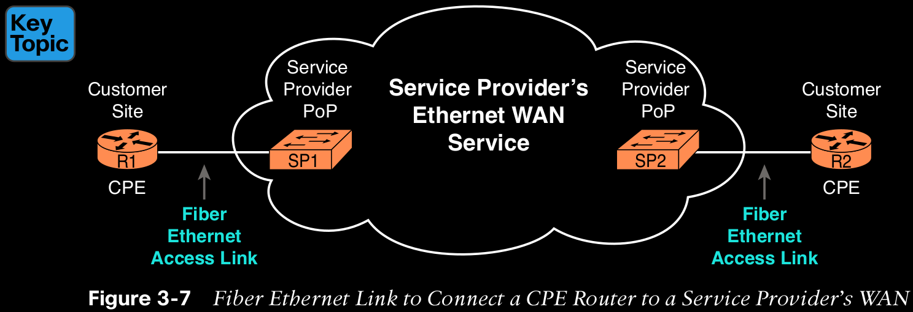
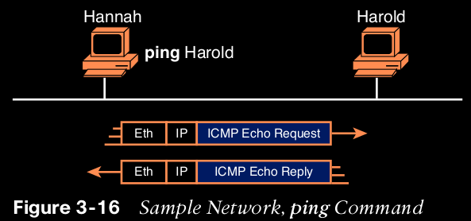

## Chapter 3 Fundamentals of WANs and IP Routing

Wide-Area Networks

WAN technologies define the physical (Layer 1) standards and data-link (Layer 2) protocols used to communicate long distances.

## Leased-Line WANs

To connect LANs using a WAN, the internetwork uses a router connected to each LAN, with a WAN link between the routers.  Note that a crooked line between the routers is the common way to represent a leased line when the drawing does not need to show any of the physical details of the line.

  
	
## Physical Details of Leased Lines   

The leased line service delivers bits in both directions, at a predetermined speed, using full duplex logic. In fact, conceptually it acts as if you had a full-duplex crossover Ethernet link between two routers, as shown in Figure 3-2. The leased line uses two pairs of wires, one pair for each direction of sending data, which allows full-duplex operation.

Leased lines is different  of crossover cable. The telco that creates the leased line installs a large network of cables and specialized switching devices to create its own computer network.

## HDLC Data-Link Details of Leased Lines

A leased line provides a Layer 1 service. The two most popular data-link layer protocols used for leased lines between two routers are High-Level Data Link Control (HDLC) and Point-to-Point Protocol (PPP). All data-link protocols perform a similar role: to control the correct delivery of data over a physical link of a particular type.

For example, the Ethernet data-link protocol uses a destination address field to identify the correct device that should receive the data and an FCS field that allows the receiving device to determine whether the data arrived correctly. HDLC provides similar functions.

  

## How Routers Use a WAN Data Link

First, the TCP/IP network layer focuses on forwarding IP packets from the sending host to the destination host.

  

In summary, a leased line with HDLC creates a WAN link between two routers so that they can forward packets for the devices on the attached LANs.

Leased lines have many benefits that have led to their relatively long life in the WAN marketplace. These lines are simple for the customer, are widely available, are of high quality, and are private. However, they do have some negatives as well compared to newer WAN technologies, including a higher cost and typically longer lead times to get the service installed. Additionally, by today’s standards, leased-line LANs are slow, with faster speeds in the tens of megabits per second (Mbps). New faster WAN technology has been replacing leased lines for a long time, including the second WAN technology discussed in this book: Ethernet.

## Ethernet as a WAN Technology

The restrictions on cable lengths and devices might allow a LAN that stretched a kilometer or two, to support a campus LAN, but that was the limit. As time went by, and as the IEEE improved cabling distances for fiber Ethernet links, Ethernet became a reasonable WAN technology. Today, many WAN service providers (SP) offer WAN services that take advantage of Ethernet.

  

## Ethernet WANs That Create a Layer 2 Service

Ethernet WAN services include a variety of specific services that vary in ways that change how routers use those services.

1. Logically, behaves like a point-to-point connection between two routers.

2. Physically, behaves as if a physical fiber Ethernet link existed between the two routers.

This book refers to this particular Ethernet WAN service with a couple of the common names:

Ethernet WAN: A generic name to differentiate it from an Ethernet LAN.

Ethernet Line Service (E-Line): A term from the Metro Ethernet Forum (MEF) for the kind of point-to-point Ethernet WAN service shown throughout this book.

Ethernet emulation: A term emphasizing that the link is not a literal Ethernet link from end to end.

Ethernet over MPLS (EoMPLS): A term that refers to Multiprotocol Label Switching (MPLS), a technology that can be used to create the Ethernet service for the customer.

So, if you can imagine two routers, with a single Ethernet link between the two routers, you understand what this particular EoMPLS service does, as shown in Figure 3-8. In this case, the two routers, R1 and R2, connect with an EoMPLS service instead of a serial link. The routers use Ethernet interfaces, and they can send data in both directions at the same time. Physically, each router actually connects to some SP PoP, as shown earlier in Figure 3-7, but logically, the two routers can send Ethernet frames to each other over the link.

## How Routers Route IP Packets Using Ethernet Emulation

 Routing over an EoMPLS WAN link still uses the WAN like a WAN, as a way to forward IP packets from one site to another.

The EoMPLS link uses Ethernet for both Layer 1 and Layer 2 functions. That means the link uses the same familiar Ethernet header and trailer, as shown in the middle of Figure 3-9. Note that the figure shows a small cloud over the Ethernet link as a way to tell us that the link is an Ethernet WAN link, rather than an Ethernet LAN link.

  

The figure shows the same three routing steps as shown with the serial link in the earlier Figure 3-6. In this case, all three routing steps use the same Ethernet (802.3) protocol. However, note that each frame’s data-link header and trailer are different. Each router discards the old data-link header/trailer and adds a new set, as described in these steps. Focus mainly on Step 2, because compared to the similar example shown in Figure 3-6, Steps 1 and 3 are unchanged:

1. To send the IP packet to Router R1 next, PC1 encapsulates the IP packet in an Ethernet frame that has the destination MAC address of R1.

2. Router R1 de-encapsulates (removes) the IP packet from the Ethernet frame and encapsulates the packet into a new Ethernet frame, with a new Ethernet header and trailer. The destination MAC address is R2’s G0/0 MAC address, and the source MAC address is R1’s G0/1 MAC address. R1 forwards this frame over the EoMPLS service to R2 next.
   
3. Router R2 de-encapsulates (removes) the IP packet from the Ethernet frame, encapsulates the packet into an Ethernet frame that has the destination MAC address of PC2, and forwards the Ethernet frame to PC2.

## IP Routing

IP concerns itself with the logical details. Focuses on the job of routing data, in the form of IP packets.

Two options exist for the main protocol around which all other network layer functions revolve: IP version 4 (IPv4) and IP version 6 (IPv6).Both IPv4 and IPv6 define the same kinds of network layer functions, but with different details. This chapter introduces these network layer functions for IPv4.

Internet Protocol (IP) focuses on the job of routing data, in the form of IP packets, from the source host to the destination host. IP does not concern itself with the physical transmission of data.

Instead, IP concerns itself with the logical details, rather than physical details, of delivering data. In particular, the network layer specifies how packets travel end to end over a TCP/IP network, even when the packet crosses many different types of LAN and WAN links.

## Network Layer Routing (Forwarding) Logic

Routers and end-user computers (called hosts in a TCP/IP network) work together to perform IP routing. The host operating system (OS) has TCP/IP software, including the software that implements the network layer.

Hosts use that software to choose where to send IP packets, often to a nearby router. Those routers make choices of where to send the IP packet next.

## Host Forwarding Logic: Send the Packet to the Default Router

In this example, PC1 does some basic analysis and then chooses to send the IP packet to the router so that the router will forward the packet. PC1 analyzes the destination address and realizes that PC2’s address (150.150.4.10) is not on the same LAN as PC1. So PC1’s logic tells it to send the packet to a device whose job it is to know where to route data: a nearby router, on the same LAN, called PC1’s default router.

To send the IP packet to the default router, the sender sends a data-link frame across the medium to the nearby router; this frame includes the packet in the data portion of the frame. That frame uses data-link layer (Layer 2) addressing in the data-link header to ensure that the nearby router receives the frame.

## R1 and R2’s Logic: Routing Data Across the Network

All routers use the same general process to route the packet. Each router keeps an IP routing table. This table lists IP address groupings, called IP networks and IP subnets. When a router receives a packet, it compares the packet’s destination IP address to the entries in the routing table and makes a match. This matching entry also lists directions that tell the router where to forward the packet next.

In Figure 3-10, R1 would have matched the destination address (150.150.4.10) to a routing table entry, which in turn told R1 to send the packet to R2 next. Similarly, R2 would have matched a routing table entry that told R2 to send the packet, over an Ethernet WAN link, to R3 next.

the router looks at the IP routing table (the equivalent of the road signs) and directs each packet over the correct next LAN or WAN link (the equivalent of a road).

## R3’s Logic: Delivering Data to the End Destination

The final router in the path, R3, uses almost the same logic as R1 and R2, but with one minor difference. R3 needs to forward the packet directly to PC2, not to some other router. On the surface, that difference seems insignificant. In the next section, when you read about how the network layer uses LANs and WANs, the significance of the difference will become obvious.

## How Network Layer Routing Uses LANs and WANs

The following list summarizes the major steps in a router’s internal network layer routing for each packet beginning with the a frame arriving in a router interface:

Step 1. Use the data-link Frame Check Sequence (FCS) field to ensure that the frame had no errors; if errors occurred, discard the frame.

Step 2. Assuming that the frame was not discarded at Step 1, discard the old data-link header and trailer, leaving the IP packet.

Step 3. Compare the IP packet’s destination IP address to the routing table, and find the route that best matches the destination address. This route identifies the outgoing interface of the router and possibly the next-hop router IP address.

Step 4. Encapsulate the IP packet inside a new data-link header and trailer, appropriate for the outgoing interface, and forward the frame.

Figure 3-11 works through a repeat example of a packet sent by PC1 to PC2, followed by a detailed analysis of each device’s routing logic. Each explanation includes the details about how PC1 and each of the three routers builds the appropriate new data-link headers.

The following list explains the forwarding logic at each router, focusing on how the routing integrates with the data link.

1. PC1 sends the packet to its default router. PC1’s network layer logic builds the IP packet, with a destination address of PC2’s IP address (150.150.4.10). The network layer also performs the analysis to decide that 150.150.4.10 is not in the local IP subnet, so PC1 needs to send the packet to R1(PC1’s default router). PC1 places the IP packet into an Ethernet data-link frame, with a destination Ethernet address of R1’s Ethernet address. PC1 sends the frame on to the Ethernet.

2. R1 processes the incoming frame and forwards the packet to R2. Because the incoming Ethernet frame has a destination MAC of R1’s Ethernet MAC, R1 decides to process the frame. R1 checks the frame’s FCS for errors, and if none, R1 discards the Ethernet header and trailer. Next, R1 compares the packet’s destination address (150.150.4.10) to its routing table and finds the entry for subnet 150.150.4.0. Because the destination address of 150.150.4.10 is in that subnet, R1 forwards the packet out the interface listed in that matching route (Serial0) to next-hop Router R2 (150.150.2.7). R1 must first encapsulate the IP packet into an HDLC frame.

3. R2 processes the incoming frame and forwards the packet to R3. R2 repeats the same general process as R1 when R2 receives the HDLC frame. R2 checks the FCS field and finds that no errors occurred and then discards the HDLC header and trailer. Next, R2 compares the packet’s destination address (150.150.4.10) to its routing table and finds the entry for subnet 150.150.4.0, a route that directs R2 to send the packet out interface Fast Ethernet 0/0 to next-hop router 150.150.3.1 (R3). But first, R2 must encapsulate the packet in an Ethernet header. That header uses R2’s MAC address and R3’s MAC address on the Ethernet WAN link as the source and destination MAC address, respectively.

4. R3 processes the incoming frame and forwards the packet to PC2. Like R1 and R2, R3 checks the FCS, discards the old data-link header and trailer, and matches its own route for subnet 150.150.4.0. R3’s routing table entry for 150.150.4.0 shows that the outgoing interface is R3’s Ethernet interface, but there is no next-hop router because R3 is connected directly to subnet 150.150.4.0. All R3 has to do is encapsulate the packet inside a new Ethernet header and trailer, but with a destination Ethernet address of PC2’s MAC address.

An example of how the router determines which data-link address to use is the IP Address Resolution Protocol (ARP). ARP dynamically learns the data-link address of an IP host connected to a LAN.

## How IP Addressing Helps IP Routing

IP defines network layer addresses that identify any host or router interface that connects to a TCP/IP network. The idea basically works like a postal address: Any interface that expects to receive IP packets needs an IP address, just like you need a postal address before receiving mail from the postal service.

## Rules for Groups of IP Addresses (Networks and Subnets)

IP defines specific rules about which IP address should be in the same IP network or IP subnet. Numerically, the addresses in the same group have the same value in the first part of the addresses.

1. Hosts on the top Ethernet: Addresses start with 150.150.1

2.  Hosts on the R1–R2 serial link: Addresses start with 150.150.2

3. Hosts on the R2–R3 EoMPLS link: Addresses start with 150.150.3

4. Hosts on the bottom Ethernet: Addresses start with 150.150.4

### The brief version of two of the foundational rules of subnetting can be summarized as follows:

1. Two IP addresses, not separated from each other by a router,
must be in the same group (subnet).
2. Two IP addresses, separated from each other by at least one 
router, must be in different groups (subnets).

## The IP Header

The routing process also makes use of the IPv4 header, as shown in Figure 3-12. The header lists a 32-bit source IP address, as well as a 32-bit destination IP address. while routers remove and add data-link headers each time it routes a packet, the IP header remains, with the IP addresses unchanged by the IP routing process.

  

## How IP Routing Protocols Help IP Routing

The best method for routers to know all the useful routes is to configure the routers to use the same IP routing protocol. However, if you enable the same routing protocol on all the routers in a TCP/IP internetwork, with the correct settings, the routers will send routing protocol messages to each other. As a result, all the routers will learn routes for all the IP networks and subnets in the TCP/IP internetwork.

IP supports a small number of different IP routing protocols. All use some similar ideas and processes to learn IP routes, but different routing protocols do have some internal differences; otherwise, you would not need more than one routing protocol. However, many routing protocols use the same general steps for learning routes:

1. Each router, independent of the routing protocol, adds a route to its routing table for each subnet directly connected to the router.

2. Each router’s routing protocol tells its neighbors about the routes in its routing table, including the directly connected routes and routes learned from other routers.

3. After learning a new route from a neighbor, the router’s routing protocol adds a route to its IP routing table, with the next-hop router of that route typically being the neighbor from which the route was learned.

Also, note that at the final step, routers may have to choose between multiple routes to reach a single subnet. When that happens, routers place the best currently available route to reach a subnet (based on a measurement called a metric) into the routing table.

Figure 3-13 shows an example of how a routing protocol works, using the same diagram as in Figures 3-10 and 3-11. In this case, IP subnet 150.150.4.0, which consists of all addresses that begin with 150.150.4.0, sits on the Ethernet at the bottom of the figure. The figure shows the advertisement of routes for subnet 150.150.4.0 from bottom to top, as described in detail following the figure.

  

Follow items A through F shown in the figure to see how each router learns its route to 150.150.4.0.

1. Subnet 150.150.4.0 exists as a subnet at the bottom of the figure, connected to Router R3.

2. R3 adds a connected route for 150.150.4.0 to its IP routing table; this happens without help from the routing protocol.

3. R3 sends a routing protocol message, called a routing update, to R2, causing R2 to learn about subnet 150.150.4.0.

4. R2 adds a route for subnet 150.150.4.0 to its routing table.

5. R2 sends a similar routing update to R1, causing R1 to learn about subnet 150.150.4.0.

6. R1 adds a route for subnet 150.150.4.0 to its routing table. The route lists R1’s own Serial0 as the outgoing interface and R2 as the next-hop router IP address (150.150.2.7).

## Other Network Layer Features

The TCP/IP network layer defines many functions beyond IP. Other protocols and standards, defined in other Requests For Comments (RFC), play an important role for network layer functions. For example, routing protocols like Open Shortest Path First (OSPF) exist as separate protocols, defined in separate RFCs.

## Using Names and the Domain Name System (DNS)

TCP/IP defines a way to use hostnames to identify other computers. TCP/IP needs a way to let a computer find the IP address used by the listed hostname, and that method uses the Domain Name System (DNS).

Enterprises use the DNS process to resolve names into the matching IP address.

Finally, DNS defines much more than just a few messages. DNS defines protocols, as well as standards for the text names used throughout the world, and a worldwide set of distributed DNS servers.

## The Address Resolution Protocol

How does a router know what MAC address to use for the destination? It uses ARP. TCP/IP defines the Address Resolution Protocol (ARP) as the method by which any host or router on a LAN can dynamically learn the MAC address of another IP host or router on the same LAN.

Note that hosts and routers remember the ARP results, keeping the information in their ARP cache or ARP table. A host or router only needs to use ARP occasionally, to build the ARP cache the first time. Each time a host or router needs to send a packet encapsulated in an Ethernet frame, it first checks its ARP cache for the correct IP address and matching MAC address.

ARP cache entries time out to clean up the table, so occasional ARP Requests can be seen.

## ICMP Echo and the ping Command

After you have implemented a TCP/IP internetwork, you need a way to test basic IP connectivity without relying on any applications to be working. The primary tool for testing basic network connectivity is the ping command.

Ping (Packet Internet Groper) uses the Internet Control Message Protocol (ICMP), sending a message called an ICMP echo request to another IP address.

The computer with that IP address should reply with an ICMP echo reply. If that works, you successfully have tested the IP network. In other words, you know that the network can deliver a packet from one host to the other and back. ICMP does not rely on any application, so it really just tests basic IP connectivity.

