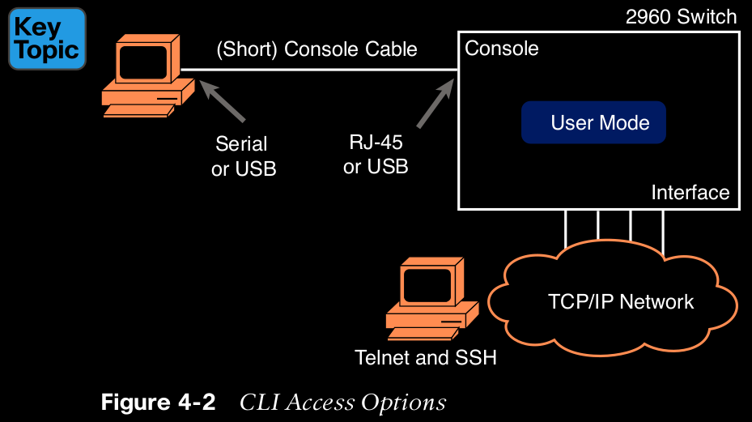
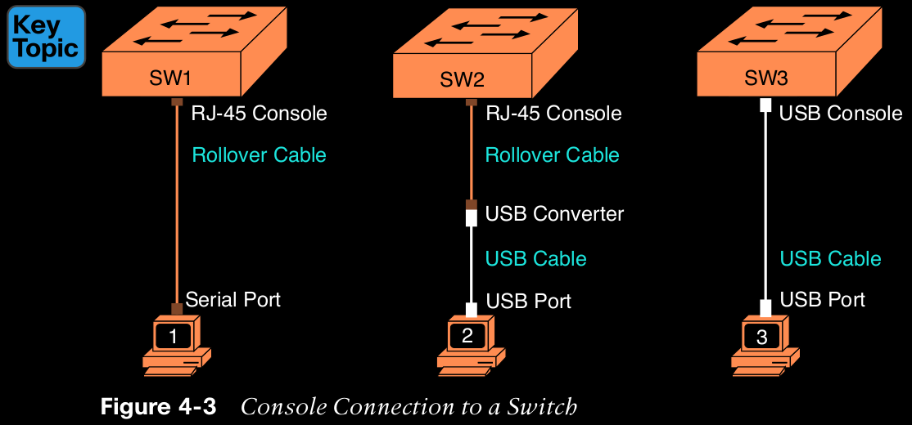
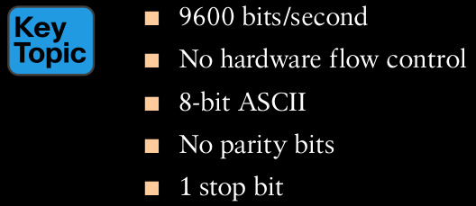
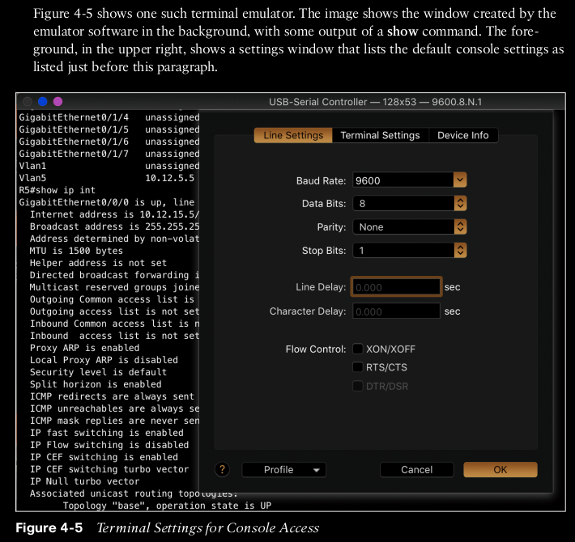
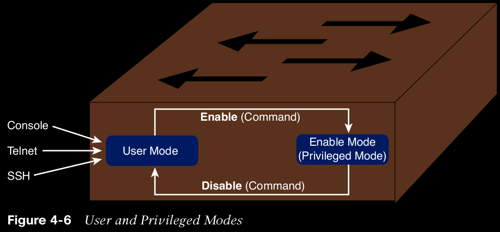

# Using the Command-Line Interface

## Accessing the Cisco Catalyst Switch CLI

Cisco uses the concept of a command-line interface (CLI) with its router products and most of its Catalyst LAN switch products.

## Cisco Catalyst Switches

Within the Cisco Catalyst brand of LAN switches, Cisco produces a wide variety of switch series or families. Each switch series includes several specific models of switches that have similar features, similar price-versus-performance tradeoffs, and similar internal components.

## Accessing the Cisco IOS CLI
Like any other piece of computer hardware, Cisco switches need some kind of operating system software. Cisco calls this OS the Internetwork Operating System (IOS).

Cisco IOS Software for Catalyst switches implements and controls logic and functions performed by a Cisco switch.

The switch CLI can be accessed through three popular methods: the console, Telnet, and Secure Shell (SSH). Two of these methods (Telnet and SSH) use the IP network in which the switch resides to reach the switch. The console is a physical port built specifically to allow access to the CLI. Figure 4-2 depicts the options.

Console access requires both a physical connection between a PC  or other user device) and the switch’s console port, as well as some software on the PC. Telnet and SSH require software on the user’s device, but they rely on the existing TCP/IP network to transmit data. The next few pages detail how to connect the console and set up the software for each method to access the CLI.

## Cabling the Console Connection

Most PCs1 today use a familiar standard USB cable for the console connection. Cisco has been including USB ports as console ports in newer routers and switches as well.

Older console connections use a PC serial port that pre-dates USB, a UTP cable, and an RJ-45 console port on the switch, as shown on the left side of Figure 4-3. The PC serial port typically has a D-shell connector (roughly rectangular) with nine pins (often called a DB-9). The console port looks like any Ethernet RJ-45 port (but is typically colored in blue and with the word console beside it on the switch).

The emulator must be configured to use the PC’s serial port to match the settings on the switch’s console port settings. The default console port settings on a switch are as follows. Note that the last three parameters are referred to collectively as 8N1:

## Accessing the CLI with Telnet and SSH

## User and Enable (Privileged) Modes

All three CLI access methods covered so far (console, Telnet, and SSH) place the user in an area of the CLI called user EXEC mode. User EXEC mode, sometimes also called user mode, allows the user to look around but not break anything. The “EXEC mode” part of the name refers to the fact that in this mode, when you enter a command, the switch executes the command and then displays messages that describe the command’s results.

Cisco IOS supports a more powerful EXEC mode called enable mode (also known as privileged mode or privileged EXEC mode). Enable mode gets its name from the enable command, which moves the user from user mode to enable mode, as shown in Figure 4-6. The other name for this mode, privileged mode, refers to the fact that powerful (or privileged) commands can be executed there. For example, you can use the reload command, which tells the switch to reinitialize or reboot Cisco IOS, only from enable mode.

NOTE If the command prompt lists the hostname followed by a >, the user is in user mode; if it is the hostname followed by the #, the user is in enable mode.

Example 4-1 demonstrates the differences between user and enable modes.

Configuring Cisco IOS Software

## Finish this chapter after

