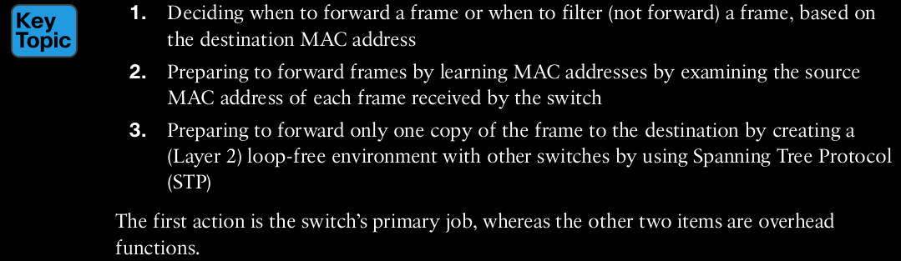
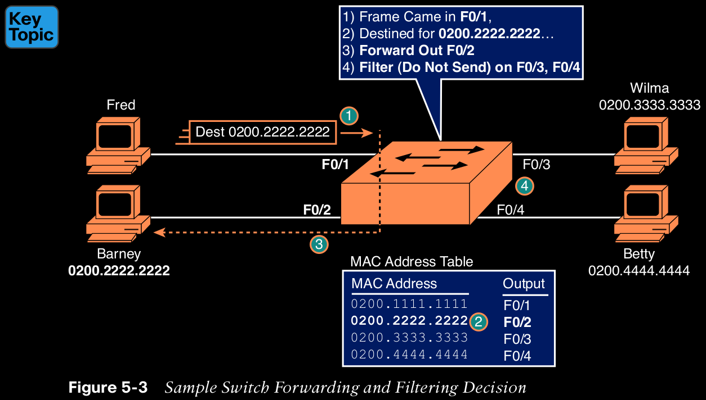
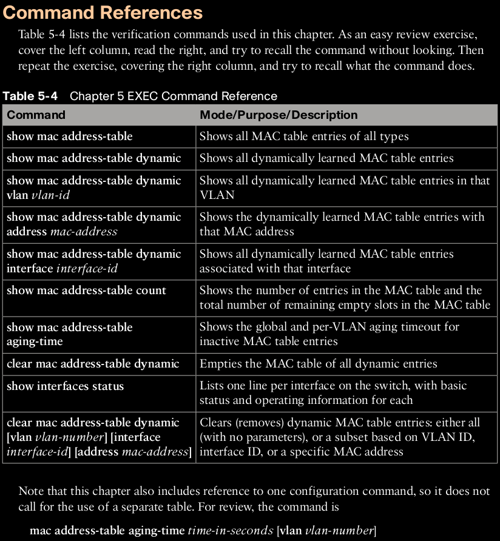

# Analyzing Ethernet LAN Switching

## LAN Switching Concepts / Overview of Switching Logic

The LAN switch has one primary job: to forward frames to the correct destination (MAC) address. And to achieve that goal, switches use logic—logic based on the source and destination MAC address in each frame’s Ethernet header.

  

## Forwarding Known Unicast Frames

To decide whether to forward a frame, a switch uses a dynamically built table that lists MAC addresses and outgoing interfaces. That matched table entry tells the switch to forward the frame out port F0/2, and only port F0/2.

>NOTE A switch’s MAC address table is also called the switching table or bridging table, or even the Content-Addressable Memory (CAM) table, in reference to the type of physical memory used to store the table.

>NOTE The forwarding choice by a switch was formerly called a forward-versus-filter decision, because the switch also chooses to not forward (to filter frames, not sending the frame out some ports.

## Learning MAC Addresses

Instead, each switch does its second main function: to learn the MAC addresses and interfaces to put into its address table.

Switches build the address table by listening to incoming frames and examining the source MAC address in the frame. If a frame enters the switch and the source MAC address is not in the MAC address table, the switch creates an entry in the table. That table entry lists the interface from which the frame arrived. Switch learning logic is that simple. 

Learning always occurs by looking at the source MAC address in the frame and adds the incoming interface as the associated port.

## Flooding Unknown Unicast and Broadcast Frames

What do you suppose the switch does with Fred’s first frame, the one that occurred when there were no entries in the MAC address table? As it turns out, when there is no matching entry in the table, switches forward the frame out all interfaces (except the incoming inter- face) using a process called flooding. And the frame whose destination address is unknown to the switch is called an unknown unicast frame, or simply an unknown unicast.

Switches flood unknown unicast frames. Flooding means that the switch forwards copies of the frame out all ports, except the port on which the frame was received. The idea is simple: if you do not know where to send it, send it everywhere, to deliver the frame. And, by the way, that device will likely then send a reply—and then the switch can learn that device’s MAC address and forward future frames out one port as a known unicast frame.

## Avoiding Loops Using Spanning Tree Protocol

The third primary feature of LAN switches is loop prevention, as implemented by Spanning Tree Protocol (STP). Without STP, any flooded frames would loop for an indefinite period.

To avoid Layer 2 loops, all switches need to use STP. STP causes each interface on a switch to settle into either a blocking state or a forwarding state. Blocking means that the interface cannot forward or receive data frames, while forwarding means that the interface can send and receive data frames. If a correct subset of the interfaces is blocked, only a single currently active logical path exists between each pair of LANs.

## LAN Switching Summary

1. Switches forward frames based on the destination MAC address:
    
    A. If the destination MAC address is a broadcast, multicast, or unknown destination unicast (a unicast not listed in the MAC table, the switch floods the frame.

    B. If the destination MAC address is a known unicast address (a unicast address found in the MAC table):

    i. If the outgoing interface listed in the MAC address table is different from the interface in which the frame was received, the switch forwards the frame out the outgoing interface.

    ii. If the outgoing interface is the same as the interface in which the frame was received, the switch filters the frame, meaning that the switch simply ignores the frame and does not forward it.

2. Switches use the following logic to learn MAC address table entries:
    
    A. For each received frame, examine the source MAC address and note the interface from which the frame was received.

    B. If it is not already in the table, add the MAC address and interface it was learned on.

3. Switches use STP to prevent loops by causing some interfaces to block, meaning that they do not send or receive frames.

## Verifying and Analyzing Ethernet Switching

## Demonstrating MAC Learning

To see a switch’s MAC address table, use the **show mac address-table** command. To see all the dynamically learned MAC addresses only, instead use the **show mac address-table** dynamic command.

Use the **erase startup-config** EXEC command to erase the startup-config file

Use the **delete vlan.dat** EXEC command to delete the VLAN configuration details

Use the **reload** EXEC command to reload the switch (thereby using the empty startup config, with no VLAN information configured)

Configure the **hostname SW1** command to set the switch hostname

## Switch Interfaces

You can easily check the status of those interfaces with the **show interfaces status** command.

As a reminder, Cisco Catalyst switches name their ports based on the fastest specification supported.

    NOTE You can see the status for a single interface in a couple of ways. For instance, for F0/1, the command show interfaces f0/1 status lists the status in a single line of output as in Example 5-2. The show interfaces f0/1 command (without the status keyword) displays a detailed set of messages about the interface.

The **show interfaces** command has a large number of options. One particular option, the counters option, lists statistics about incoming and outgoing frames on the interfaces. In particular, it lists the number of unicast, multicast, and broadcast frames (both the in and out directions), and a total byte count for those frames. Example 5-3 shows an example, again for interface F0/1.

## Finding Entries in the MAC Address Table

Cisco IOS supplies several more options on the show mac address-table command to make it easier to find individual entries.

    Ex: show mac address-table dynamic address 0200.1111.1111
        show mac address-table dynamic interface fastEthernet 0/1
        show mac address-table dynamic vlan 1

## Managing the MAC Address Table (Aging, Clearing)

The switch times out (removes) any entries whose timer reaches the defined aging time.

    Ex: show mac address-table aging-time

Finally, you can remove the dynamic entries from the MAC address table with the **clear mac address-table dynamic** command.

Note that the show commands in this chapter can be executed from user and enable mode, but the clear command happens to be an enable mode command. The command also allows parameters to limit the types of entries cleared, as follows:

By VLAN: clear mac address-table dynamic vlan vlan-number

By Interface: clear mac address-table dynamic interface interface-id

By MAC address: clear mac address-table dynamic address mac-address

## MAC Address Tables with Multiple Switches

## Command References

  
