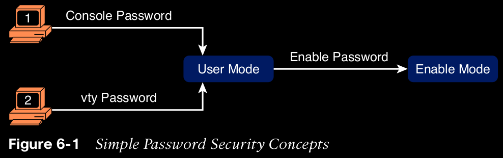
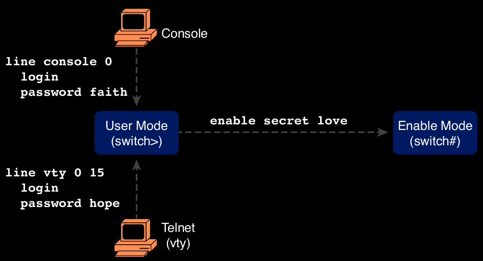
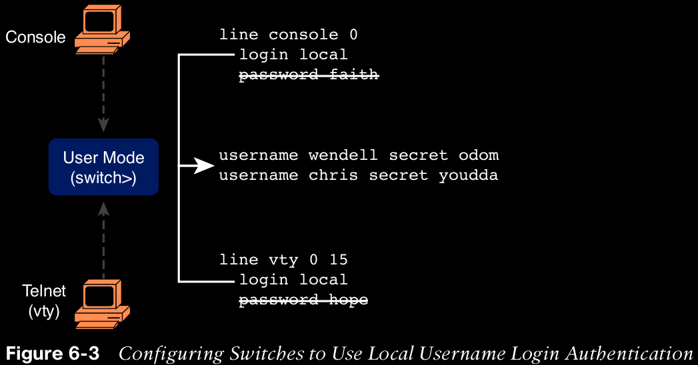
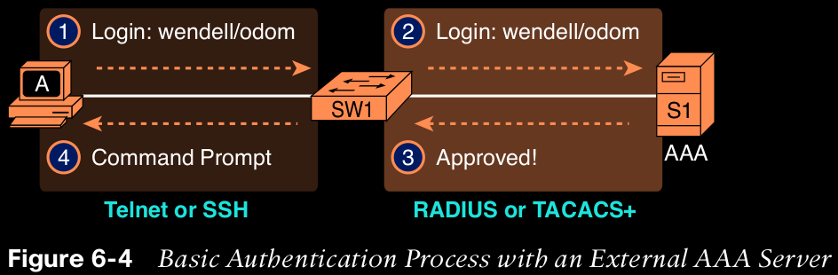
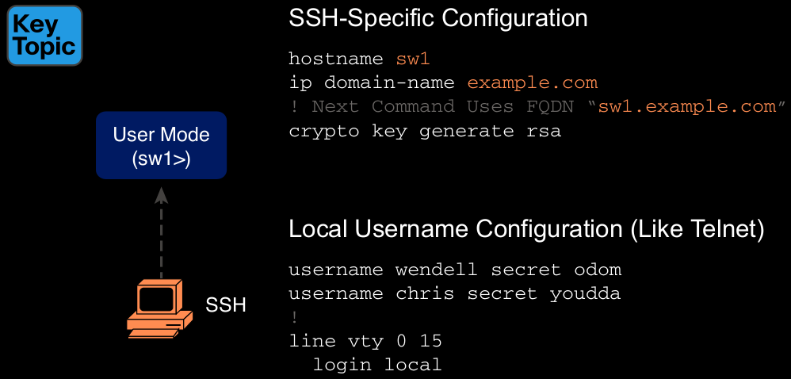
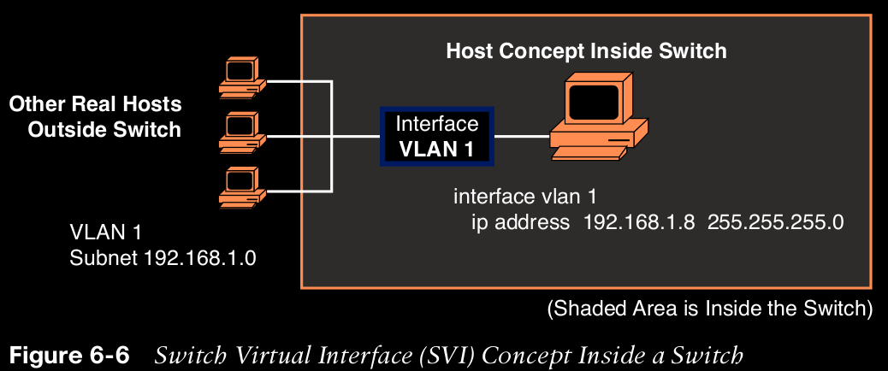

# Configuring Basic Switch Management

The work performed by a networking device can be divided into three broad categories.

The first and most obvious, called the data plane, is the work a switch does to forward frames generated by the devices connected to the switch.

Second, the control plane refers to the configuration and processes that control and change the choices made by the switch’s data plane.

The third category, the management plane, deals with managing the device itself, rather than controlling what the device is doing.

## Securing the Switch CLI

By default, a Cisco Catalyst switch comes without any kind of security. Lets see how to secure them.

## Securing User Mode and Privileged Mode with Simple Passwords

Most people use a simple shared password for access to lab gear. This method uses a password only-with no username—with one password for console users and a different password for Telnet users. Console users must supply the console password, as configured in console line configuration mode. Telnet users must supply the Telnet password, also called the vty password, so called because the configuration sits in vty line configuration mode.

  

    NOTE: This section refers to several passwords as shared passwords. Users share these passwords in that all users must know and use that same password. In other words, each user does not have a unique username/password to use, but rather, all the appropriate staff knows and uses the same password.

The configuration for these three passwords does not require a lot of work.

**password** password-value: Defines the actual password used on the console or vty 

**login:** Tells IOS to enable the use of a simple shared password (with no username) on this line (console or vty), so that the switch asks the user for a password

  

    NOTE Older IOS versions used the command enable password password-value to set the enable password, and that command still exists in IOS. However, the enable secret command is much more secure. In real networks, use enable secret. Chapter 5, “Securing Network Devices,” in the CCNA 200-301 Official Cert Guide, Volume 2, explains more about the security levels of various password mechanisms, including a comparison of the enable secret and enable password commands.

The configuration checklist for shared passwords for the console, Telnet, and enable passwords is:

1. Configure the enable password with the enable secret password-value
command.

2. Configure the console password:

    A. Use the line con 0 command to enter console configuration mode.

    B. Use the password password-value subcommand to set the value of the console password.

    C. Use the login subcommand to enable console password security using a simple password.

3. Configure the Telnet (vty) password:
    
    A. Use the line vty 0 15 command to enter vty configuration mode for all 16 vty lines (numbered 0 through 15).

    B. Use the password password-value subcommand to set the value of the console password.

    C. Use the login subcommand to enable console password security using a simple password.

## Securing User Mode Access with Local Usernames and Passwords

Switches support this local username/password option for the console, for Telnet, and even for SSH, but do not replace the enable password used to reach enable mode.

  

The following checklist details the commands to configure local username login, mainly as a method for easier study and review:

1. Use the username name secret password global configuration command to add one or more username/password pairs on the local switch.

2. Configure the console to use locally configured username/password pairs:

    A. Use the line con 0 command to enter console configuration mode.

    B. Use the login local subcommand to enable the console to prompt for both username and password, checked versus the list of local usernames/passwords.

    C. (Optional) Use the no password subcommand to remove any existing simple shared passwords, just for good housekeeping of the configuration file.

3. Configure Telnet (vty) to use locally configured username/password pairs.
   
   A. Use the line vty 0 15 command to enter vty configuration mode for all 16 vty lines (numbered 0 through 15).

   B. Use the login local subcommand to enable the switch to prompt for both username and password for all inbound Telnet users, checked versus the list of local usernames/passwords.

   C. (Optional) Use the no password subcommand to remove any existing simple shared passwords, just for good housekeeping of the configuration file.

## Securing User Mode Access with External Authentication Servers

However, using a username/password configured directly on the switch causes some administrative headaches. Cisco switches allow exactly that option using an external server called an authentication, authorization, and accounting (AAA) server.

When using a AAA server for authentication, the switch (or router) simply sends a message to the AAA server asking whether the username and password are allowed, and the AAA server replies.

  

## Securing Remote Access with Secure Shell

Telnet has one serious disadvantage: all data in the Telnet session flows as clear text, including the password exchanges.

Figure 6-5 shows one example configuration of what is required to support SSH.

  

To control which protocols a switch supports on its vty lines, use the transport input {all | none | telnet | ssh} vty subcommand in vty mode, with the following options:
**transport input all** or **transport input telnet ssh**: Support both Telnet and SSH
**transport input none**: Support neither
**transport input telnet**: Support only Telnet
**transport input ssh**: Support only SSH

1. Configure the switch to generate a matched public and private key pair to use for encryption:
   A. If not already configured, use the hostname name in global configuration mode to configure a hostname for this switch.

   B. If not already configured, use the ip domain-name name in global configuration mode to configure a domain name for the switch, completing the switch’s FQDN.

   C. Use the crypto key generate rsa command in global configuration mode (or the crypto key generate rsa modulus modulus-value command to avoid being prompted for the key modulus) to generate the keys. (Use at least a 768-bit key to support SSH version 2.)

2. (Optional) Use the ip ssh version 2 command in global configuration mode to override the default of supporting both versions 1 and 2, so that only SSHv2 connections are allowed.

3. (Optional) If not already configured with the setting you want, configure the vty lines to accept SSH and whether to also allow Telnet:

    A. Use the transport input ssh command in vty line configuration mode to allow SSH only.

    B. Use the transport input all command (default) or transport input telnet ssh command in vty line configuration mode to allow both SSH and Telnet.

4. Use various commands in vty line configuration mode to configure local username login authentication as discussed earlier in this chapter.

    NOTE Cisco routers often default to transport input none, so you must add the transport input line subcommand to enable Telnet and/or SSH into a router.

Displaying SSH Status:
    show ip ssh
    show ssh

## Enabling IPv4 for Remote Access

## Host and Switch IP Settings

  

By using interface VLAN 1 for the IP configuration, the switch can then send and receive frames on any of the ports in VLAN 1. In a Cisco switch, by default, all ports are assigned to VLAN 1.

The reason a switch needs a default gateway setting is the same reason that hosts need the same setting—because of how hosts think when sending IP packets. Specifically:

    To send IP packets to hosts in the same subnet, send them directly

    To send IP packets to hosts in a different subnet, send them to the local router; that is, the default gateway.

## Configuring IPv4 on a Switch

A switch configures its IPv4 address and mask on this special NIC-like VLAN interface. The following steps list the commands used to configure IPv4 on a switch, assuming that the IP address is configured to be in VLAN 1, with Example 6-7 that follows showing an example configuration.

1. Use the interface vlan 1 command in global configuration mode to enter interface VLAN 1 configuration mode.

2. Use the ip address ip-address mask command in interface configuration mode to assign an IP address and mask.

3. Use the no shutdown command in interface configuration mode to enable the VLAN 1 interface if it is not already enabled.

4. Add the ip default-gateway ip-address command in global configuration mode to configure the default gateway.

5. (Optional) Add the ip name-server ip-address1 ip-address2 … command in global configuration mode to configure the switch to use Domain Name System (DNS) to resolve names into their matching IP address.

On a side note, this example shows a particularly important and common command: the [no] shutdown command. To administratively enable an interface on a switch, use the no shutdown interface subcommand; to disable an interface, use the shutdown interface subcommand.

## Configuring a Switch to Learn Its IP Address with DHCP

The switch can also use Dynamic Host Configuration Protocol (DHCP) to dynamically learn its IPv4 settings. Basically, all you have to do is tell the switch to use DHCP on the interface and enable the interface. Assuming that DHCP works in this network, the switch will learn all its settings.

1. Enter VLAN 1 configuration mode using the interface vlan 1 global configuration command, and enable the interface using the no shutdown command as necessary.

2. Assign an IP address and mask using the ip address dhcp interface subcommand.

## Verifying IPv4 on a Switch

## Miscellaneous Settings Useful in the Lab

Finish after