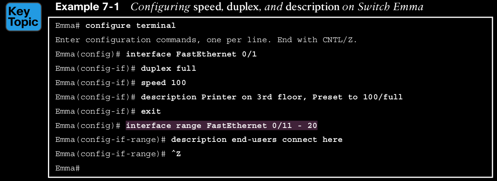

## Configuring and Verifying Switch Interfaces

IOS uses the term interface to refer to physical ports used to forward data to and from other devices.

## Configuring Speed, Duplex, and Description

You can configure the speed and duplex settings with the **duplex {auto | full | half}** and **speed {auto | 10 | 100 | 1000}** interface subcommands. Simple enough.

  

## Configuring Multiple Interfaces with the interface range Command

